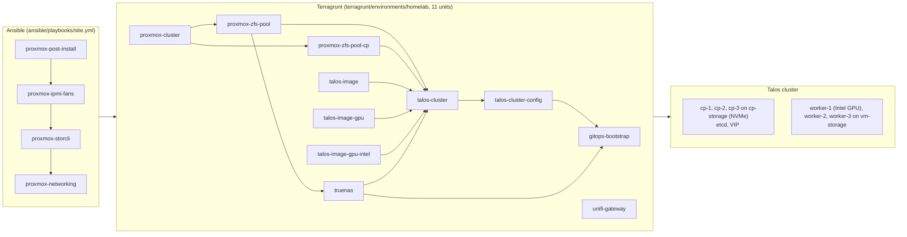
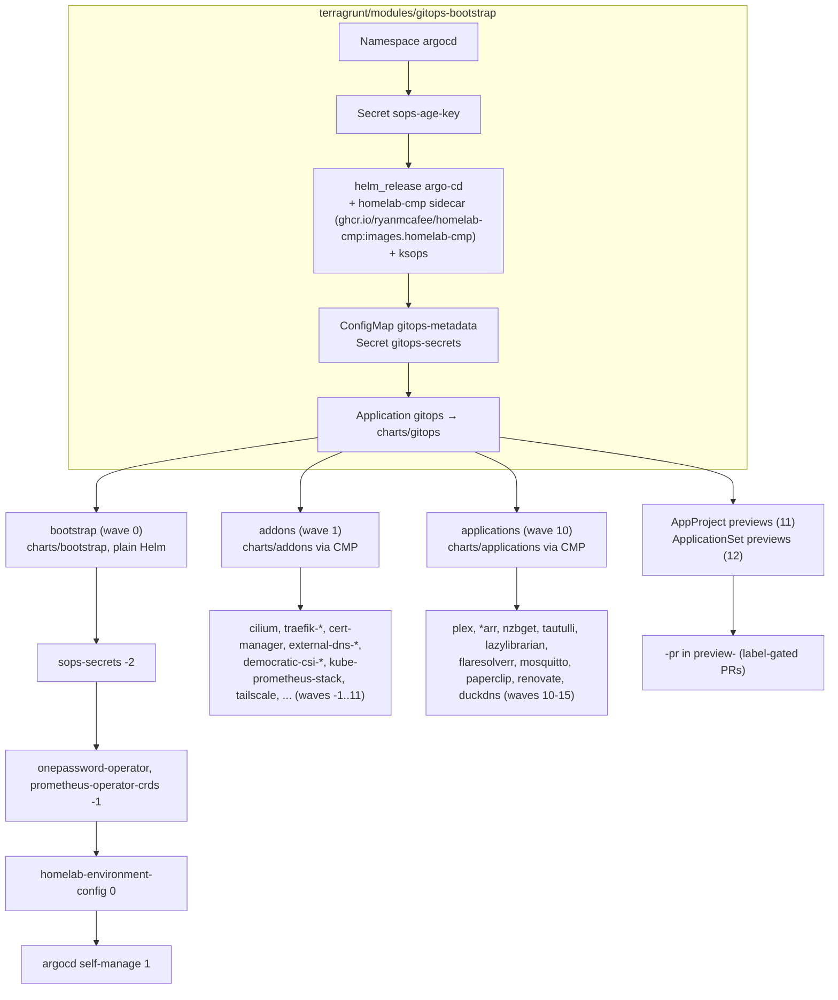
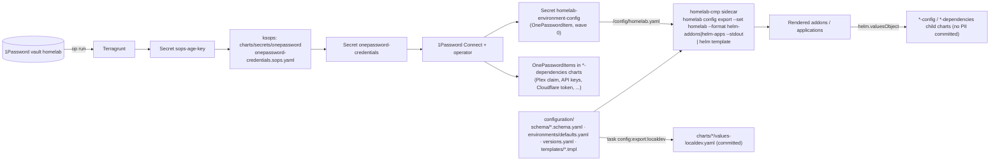
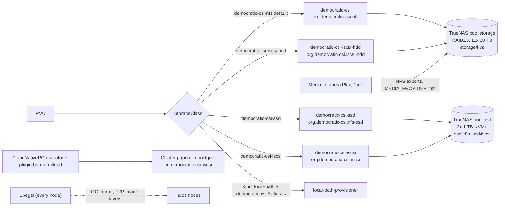
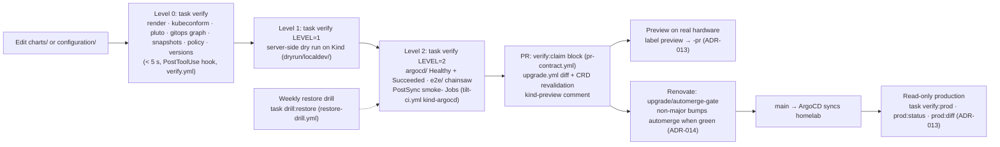

# Architecture

How the homelab is built, layer by layer, from the repository as it is today. Each section
is the zoomed-in version of one row of the README header: one diagram, then the resources
behind it. Versions quoted here come from `configuration/versions.yaml`; addresses are
`<KEY>` placeholders resolved from the gitignored `configuration/environments/homelab.yaml`.

- [Provisioning](#provisioning): Ansible → Terragrunt → Talos
- [GitOps bridge](#gitops-bridge): Terraform hands the cluster to ArgoCD
- [Secrets and configuration](#secrets-and-configuration): SOPS, 1Password, the CMP
- [Storage](#storage): democratic-csi, TrueNAS, CloudNativePG, Spegel
- [Verification](#verification): levels 0-2, previews, read-only production, drills
- [Technology stack](#technology-stack), [Design patterns](#design-patterns), [References](#references)

Decisions are recorded as ADRs in `docs/project_notes/decisions.md` and referenced by
number below.

---

## Provisioning

**Ansible** prepares the Proxmox host. `site.yml` runs, in order, `proxmox-post-install`
(repositories, packages, timezone), `proxmox-ipmi-fans` (Noctua fan thresholds, role
`proxmox_ipmi`), `proxmox-storcli` (HBA tooling, only when `storcli_package_path` is set) and
`proxmox-networking` (VLAN-aware `vmbr0`). Two more playbooks run on demand:
`proxmox-log-retention.yml` (role `proxmox_log_retention`, journald and logrotate caps) and
`truenas-full-setup.yml` / `truenas-setup.yml` (role `truenas_storage`, creates the TrueNAS
pools through its API). `task ansible:apply` runs `site.yml`.

**Terragrunt** builds the VMs. The eleven units under `terragrunt/environments/homelab/`
form the DAG above; `dependency` blocks are the edges.

| Unit | Depends on | Creates |
|------|------------|---------|
| `proxmox-cluster` | — | Provider wiring, resource pool |
| `proxmox-zfs-pool` | proxmox-cluster | `vm-storage`: 2x NVMe mirror for worker and TrueNAS system disks |
| `proxmox-zfs-pool-cp` | proxmox-cluster | `cp-storage`: single Samsung 990 PRO for the control-plane disks (same module, storage only; ADR-016) |
| `truenas` | proxmox-zfs-pool | TrueNAS VM with the HBA and SATA controllers passed through |
| `talos-image`, `talos-image-gpu`, `talos-image-gpu-intel` | — | Image Factory schematics (`talos/image/schematic*.yaml`) → `factory.talos.dev/installer/<schematic>:<talos_version>` |
| `talos-cluster` | both pools, the three images, truenas | 3 control planes + 3 workers, machine configs with the etcd, CSI and GPU patches |
| `talos-cluster-config` | talos-cluster | kubeconfig/talosconfig handoff |
| `gitops-bootstrap` | talos-cluster-config, truenas | ArgoCD and the root Application ([GitOps bridge](#gitops-bridge)) |
| `unifi-gateway` | — | FRR BGP neighbour config on the UniFi gateway ([networking.md](./networking.md)) |

`task tf:plan:component COMPONENT=<unit>` / `task tf:apply:component COMPONENT=<unit>` run a
unit through `op run` so the Proxmox and Talos credentials come from 1Password;
`task tf:apply` runs them all. `terragrunt/environments/localdev/` has two units
(`kind-cluster`, `gitops-bootstrap`) for the same module against Kind.

**Talos** is the node OS (ADR-002): immutable, API-driven, no SSH. The cluster is three
control planes and three workers. Control-plane system disks live on `cp-storage`, workers on
`vm-storage`; the control planes share the Talos layer-2 VIP `<CP_VIP>` and etcd is tuned for
virtualised disks (`heartbeat-interval=250`, `election-timeout=2500`, metrics on `:2381`,
scraped by kube-prometheus-stack). `worker-1` carries the Intel Arc GPU (`gpu_vendor =
"intel"` in `env.hcl`, `GPU_VENDOR=intel` in the configuration); the NVIDIA image and patch
remain in the repo as the previous vendor. Cilium, kubelet-csr-approver and Spegel are
rendered as Talos inline manifests (`task render`, stored in 1Password) so the cluster has a
CNI before ArgoCD exists.

**Why the pools are split.** The control planes used to share `vm-storage` with every worker
disk; one worker unpacking a large image stalled etcd's fsync for tens of seconds on all
three members, leases expired and the VIP moved, which looked like an API outage. ADR-016
moved the control-plane disks to their own NVMe (PR #288) and added the etcd tuning, the
etcd scrape and `task apiserver:probe`, which probes the VIP and each control plane side by
side. Runbook: [runbooks/control-plane-storage.md](./runbooks/control-plane-storage.md);
hardware detail: [hardware.md](./hardware.md).

---

## GitOps bridge

Terraform builds the runway, ArgoCD flies the plane (ADR-001). `gitops-bootstrap` creates, in
this order: the `argocd` namespace; the `sops-age-key` Secret (from
`op://homelab/sops-age-key/private_key`); the `argo-cd` Helm release with the `homelab-cmp`
sidecar on the repo server (image `ghcr.io/ryanmcafee/homelab-cmp`, tag from
`configuration/versions.yaml` `images.homelab-cmp`) and ksops enabled through
`kustomize.buildOptions`; the GitOps Bridge `gitops-metadata` ConfigMap and `gitops-secrets`
Secret (cluster name, environment, repo, revision); and the root Application `gitops`
pointing at `charts/gitops`. It then waits for ArgoCD and reads
`argocd-initial-admin-secret`. From here on nothing outside Git changes the cluster.

`charts/gitops` is the app-of-apps. In homelab (`values-homelab.yaml`) it renders four
things; the sync waves below are the values production runs (the chart defaults are `addons`
2 and `applications` 3).

| Wave | Resource | Source | How it renders |
|------|----------|--------|----------------|
| 0 | Application `bootstrap` | `charts/bootstrap` | plain Helm (it installs the CMP, so it cannot use it); `helm.valuesObject` injects the ArgoCD ingress host from `global.domain` |
| -3 | Namespace `onepassword-operator`, ServiceAccount/Role/RoleBinding `secret-transformer` | bootstrap | |
| -2 | Application `sops-secrets` | `charts/secrets/onepassword` | kustomize + ksops decrypts `onepassword-credentials.sops.yaml` with `sops-age-key` |
| -1 | Job `onepassword-credentials-transformer` (Sync hook), Application `onepassword-operator` | bootstrap | 1Password Connect + operator (`connect` chart) |
| -1 | Application `prometheus-operator-crds` | bootstrap | ServiceMonitor/PodMonitor/PrometheusRule CRDs (`charts.prometheus-operator-crds`) before ArgoCD and cert-manager render theirs; kube-prometheus-stack runs with `crds.enabled=false` |
| 0 | OnePasswordItem `homelab-environment-config`, `argocd-notifications-secret` | bootstrap | the operator materialises the Secrets |
| 1 | Application `argocd` | bootstrap | ArgoCD manages its own release from then on |
| 1 | Application `addons` | `charts/addons` | CMP `homelab-config-helm-v1.0`, `FORMAT=helm-addons`; children at waves -1..11 |
| 10 | Application `applications` | `charts/applications` | CMP, `FORMAT=helm-apps`; children at waves 10-15 |
| 11 / 12 | AppProject `previews`, ApplicationSet `previews` | `charts/applications` | pull-request generator; PRs labelled `preview` (+ `preview:<app>`) get `<app>-pr<N>` in namespace `preview-<N>` (ADR-013) |

The homelab snapshot (`tests/snapshots/homelab/`) contains 68 ArgoCD Applications plus the
ApplicationSet; [applications.md](./applications.md) lists every one with its chart,
version, ingress and test coverage. In localdev `bootstrap` and `previews` are disabled and
`addons`/`applications` use plain Helm with the committed `values-localdev.yaml`; the Kind
loop syncs the working tree with `argocd app sync --local` (ADR-012,
[local-development.md](./local-development.md)).

---

## Secrets and configuration

**Secrets** (ADR-003). The only long-lived secret Terraform places in the cluster is the age
key. Everything else arrives through two channels: SOPS-encrypted files decrypted by ksops
at render time (today one file, `charts/secrets/onepassword/onepassword-credentials.sops.yaml`,
which bootstraps the 1Password Connect server) and `OnePasswordItem` resources that the
operator turns into Secrets (`vaults/homelab/items/<name>`). `task sops:setup` and
`task sops:bootstrap` manage the key; `docs/secrets.md` has the day-to-day commands. The
`argocd-notifications-secret` item feeds deploy notifications (ADR-013).

**Configuration.** Every environment-specific value lives in `configuration/`: key
declarations in `schema/*.schema.yaml` (applications, gpu, infrastructure, kubernetes,
network, platform, secrets), shared defaults in `environments/defaults.yaml`, the production
values in the gitignored `environments/homelab.yaml` (template `homelab.yaml.example`), the
Kind values in `environments/localdev.yaml`, every chart/image/tool version in
`versions.yaml`, and one Go template per consumer format in `templates/`
(`helm-addons`, `helm-apps`, `env`, `json`). `homelab config eval` resolves
schema defaults → defaults → environment; `export` renders a template; `guard` scans staged
files for the real values (`task config:validate | eval | export | guard`, a pre-commit hook
and `config-validation.yml` in CI).

**Production render.** The operator writes the `homelab-environment-config` Secret; the repo
server mounts it into the `homelab-cmp` container at `/config/homelab.yaml`; for every
Application that names plugin `homelab-config-helm-v1.0` (`cmp/plugin.yaml`, image built by
`Dockerfile.cmp`) the sidecar runs `homelab config export --set homelab --format
$ARGOCD_ENV_FORMAT --env-file /config/homelab.yaml --stdout` and pipes the result into
`helm template`. No IP, hostname or e-mail is committed; the `chart.version` values in
`charts/*/values.yaml` are placeholders overridden from `versions.yaml` at render time.

**Localdev equivalent** (ADR-011, ADR-012). Kind has no CMP, so `task config:export:localdev`
renders the same templates with `--set localdev` into the committed
`charts/addons/values-localdev.yaml` and `charts/applications/values-localdev.yaml`; level 0
fails when they are stale. Every Kind difference is a capability key in
`configuration/schema/platform.schema.yaml`, never an environment-name branch:

| Key | homelab | localdev |
|-----|---------|----------|
| `CNI_PROVIDER` | cilium | cilium |
| `LOAD_BALANCER_ENABLED` | true | false (NodePort) |
| `EXTERNAL_DNS_ENABLED` | true | false |
| `STORAGE_PROVIDER` | democratic-csi | local-path |
| `MEDIA_PROVIDER` | nfs | ephemeral |
| `CERT_ISSUER` | letsencrypt | selfsigned |
| `SECRETS_PROVIDER` | onepassword | none (`localdev/fakes/`) |
| `ARGOCD_AUTOMATED_SYNC` | true | false (`argocd app sync --local`) |

**Child charts** (ADR-010). `*-config` and `*-dependencies` charts stay on plain
`helm.valueFiles`; anything derived from the configuration (domain, hosts, IPs, iSCSI portal,
e-mail) reaches them through the parent Application's `helm.valuesObject`, so their
committed `values-homelab.yaml` carries no PII. Level 0 mirrors this by feeding each child
the `valuesObject` extracted from the rendered parent.

---

## Storage

**democratic-csi → TrueNAS** (ADR-004, ADR-008). Four Applications from one chart
(`charts.democratic-csi`), all in namespace `democratic-csi` at sync wave 2, each with its
own driver name and StorageClass; the API key comes from Secret `truenas-api-key`, the
portal is `ISCSI_TARGET_PORTAL` (`<TRUENAS_IP>:3260`).

| StorageClass | Driver | TrueNAS parent | Use |
|--------------|--------|----------------|-----|
| `democratic-csi-nfs` (default, Retain, NFSv4) | `freenas-nfs` | `storage/k8s` (`TRUENAS_ZONE_PARENT`) | General config volumes |
| `democratic-csi-ssd` | `freenas-nfs` | `ssd/k8s` (`TRUENAS_ZONE_SSD_PARENT`) | Fast NFS |
| `democratic-csi-iscsi` | `freenas-api-iscsi` | `ssd/iscsi` (`TRUENAS_ISCSI_PARENT`) | SQLite-heavy apps and Postgres (block, `STORAGE_CLASS_ISCSI_SSD`) |
| `democratic-csi-iscsi-hdd` | `freenas-api-iscsi` | `storage/k8s` (`TRUENAS_ISCSI_HDD_PARENT`) | Large block volumes |

Media libraries are not PVCs: they are NFS exports of the `storage` pool mounted directly
(`MEDIA_PROVIDER=nfs`; the permission model is ADR-006/ADR-007). Kind uses
`local-path-provisioner` (`STORAGE_PROVIDER=local-path`) plus `democratic-csi-*` StorageClass
aliases from `localdev/fakes/storageclasses.yaml`, so charts that name a homelab class still
bind.

**Databases.** `cloudnative-pg` (wave 10) and `cnpg-barman-cloud` (wave 11,
`plugin-barman-cloud`) provide Postgres; Paperclip is the one consumer today, a
`Cluster` in `charts/paperclip-database` on the iSCSI SSD class (ADR-015). The barman plugin
is off by default and exercised by the restore drill ([Verification](#verification)).

**Images.** Spegel (wave 0) runs on every node as a peer-to-peer OCI mirror for the
registries it lists (docker.io, ghcr.io, quay.io, registry.k8s.io, ...), so a layer pulled
once is served from inside the cluster afterwards; Talos keeps unpacked layers for it. Kind
gets the same effect from pull-through registry caches started by `task localdev:kind`.

---

## Verification

One verification contract, three levels, all through `homelab verify` (ADR-009, ADR-014;
every check name is in [runbooks/verification.md](./runbooks/verification.md)):

| Level | Command | What it proves | Where it runs |
|-------|---------|----------------|---------------|
| 0 | `task verify` / `task verify:text` | Every chart renders for `localdev`, `homelab` and `homelab-preview`; manifests validate against vendored CRD schemas (`tests/schemas/`); the gitops graph is consistent; golden snapshots (`tests/snapshots/`) match byte for byte; conftest policies pass (`tests/policy/`); every rendered chart version is in `versions.yaml` | after every agent edit (`.claude/settings.json` hook), pre-commit, `verify.yml` |
| 1 | `task verify LEVEL=1` | `kubectl apply --server-side --dry-run=server` of every localdev chart: admission webhooks, CRD versions, missing namespaces | Kind |
| 2 | `task verify LEVEL=2` | Every Application `Healthy` with a `Succeeded` operation, and every chainsaw suite in `tests/e2e/` (17 suites) passes | Kind, `tilt-ci.yml` job `kind-argocd` |

**Smoke Jobs.** Each application with an HTTP endpoint renders a PostSync hook Job
`smoke-<app>` (`charts/*/templates/_smoke.tpl`, `curlimages/curl` at `images.curl`) that
polls `<app>.smoke.url` until an expected status comes back, so a sync only reaches
`Succeeded` when the endpoint answers. Health for custom resources comes from the Lua in
`charts/bootstrap/files/health/` (`task test:health` evaluates it against fixtures without a
cluster). [applications.md](./applications.md) shows which apps have a suite and a smoke Job.

**Pull requests.** `task verify:claim` prints the level-0 claim for the PR body and
`pr-contract.yml` re-runs it on the head; `upgrade.yml` renders the upstream chart at the
base ref against the PR (`task verify:upgrade -- --base origin/main`) and revalidates every
custom resource; the Kind loop posts `task localdev:report` as the sticky `kind-preview`
comment. A maintainer can label a PR `preview` (+ `preview:<app>`) to render it on the real
cluster as `<app>-pr<N>` in namespace `preview-<N>` under AppProject `previews`
(`docs/runbooks/previews.md`, ADR-013).

**Production is read-only for agents.** `task prod:kubeconfig` once, then
`task verify:prod`, `task prod:status`, `task prod:diff -- <app>` through the
`homelab-readonly` context (ServiceAccount `agent-readonly`, Tailscale API server proxy) and
the read-only ArgoCD `agent` account (`docs/runbooks/readonly-access.md`, ADR-013).

**Drills and upgrades.** `task drill:restore` (`tests/drills/`, weekly in `restore-drill.yml`)
backs up a CloudNativePG cluster to a throwaway `versitygw` S3 endpoint through the barman
plugin and restores it in Kind. Renovate bumps only `configuration/versions.yaml`
(`.github/renovate.json5`); `upgrade.yml` sets the `upgrade/automerge-gate` status on
`renovate/*` branches and non-major bumps merge only when every check and the gate are green
(ADR-014). `task scaffold -- app <name> --pattern operator|helm|deps-main-config` adds a new
app with templates, schema keys, e2e and health in one step.

---

## Technology stack

Pinned versions are in `configuration/versions.yaml` (`tools.*`, `charts.*`, `images.*`) and
installed by mise (`mise.toml`); this table names the pieces, the file has the numbers.

| Layer | Technology | Where |
|-------|------------|-------|
| Hypervisor | Proxmox VE on a Supermicro AMD host | `ansible/`, [hardware.md](./hardware.md) |
| Storage appliance | TrueNAS SCALE (pools `storage`, `ssd`) | `terragrunt/modules/truenas`, `ansible/playbooks/truenas-*.yml` |
| Node OS / Kubernetes | Talos Linux (`tools.talos`) / Kubernetes (`tools.kubernetes`) | `terragrunt/modules/talos-cluster`, `talos/` |
| IaC | Terraform (`tools.terraform`) via Terragrunt | `terragrunt/` |
| Host configuration | Ansible | `ansible/` |
| GitOps | ArgoCD (`charts.argocd`, CLI `tools.argocd`), Helm (`tools.helm`) | `charts/gitops`, `charts/bootstrap` |
| CNI, load balancer | Cilium (`charts.cilium`) with LB IPAM + BGP to the UniFi gateway | [networking.md](./networking.md) |
| Ingress | Traefik (`charts.traefik`) ×2: `external`, `internal`; cert-manager; external-dns (Cloudflare, UniFi) | [networking.md](./networking.md) |
| Remote access | Tailscale operator (`charts.tailscale-operator`) | [networking.md](./networking.md) |
| Secrets | 1Password Connect + operator (`charts.onepassword-connect`), SOPS/age via ksops | [Secrets and configuration](#secrets-and-configuration) |
| Storage | democratic-csi (`charts.democratic-csi`), CloudNativePG (`charts.cloudnative-pg`, `charts.plugin-barman-cloud`), Spegel (`charts.spegel`) | [Storage](#storage) |
| Observability | kube-prometheus-stack (`charts.kube-prometheus-stack`), etcd scrape, Grafana behind the internal ingress; Alertmanager pushes critical (high priority) and warning (low priority) alerts to Pushover, credentials from one 1Password item (`docs/runbooks/alerting.md`) | `charts/addons/templates/kube-prometheus-stack.yaml`, `charts/prometheus-config` |
| CLI and scripts | Go CLI `homelab` (`cmd/homelab`, `internal/`), TypeScript on Bun (`scripts/`), Taskfile (ADR-005) | `Taskfile.yml` |
| Local loop | Kind (`tools.kind`, `images.kind-node`) + ArgoCD `--local` sync, chainsaw (`tools.chainsaw`) | [local-development.md](./local-development.md) |
| Updates | Renovate (`.github/renovate.json5`, app `renovate` in-cluster) | [Verification](#verification) |

## Design patterns

| Pattern | Where it shows up |
|---------|-------------------|
| GitOps Bridge | Terraform creates ArgoCD, metadata ConfigMap/Secret and one root Application, then steps back |
| App of Apps | `gitops` → `bootstrap` / `addons` / `applications` / `previews`, sync waves for order (ADR-001) |
| Environment parity by capability | Same charts and Applications in Kind and homelab; differences are `platform.schema.yaml` keys (ADR-011, ADR-012) |
| Centralised configuration | One schema-driven pipeline (`homelab config`) feeds Helm values, a dotenv file and JSON; production values never committed |
| Parent-owned derived values | Child charts get PII-derived values from `helm.valuesObject`, not from committed files (ADR-010) |
| Executable contract | Level 0/1/2 verification, smoke hooks, previews, read-only production, drills and the Renovate gate (ADR-009, ADR-013, ADR-014) |
| Monorepo | Infrastructure, charts, CLI, scripts, tests and docs in one repository, one PR per change |

## References

- [GitOps Bridge pattern](https://github.com/gitops-bridge-dev/gitops-bridge)
- [Talos on Proxmox with OpenTofu (stonegarden.dev)](https://blog.stonegarden.dev/articles/2024/08/talos-proxmox-tofu/)
- [TrueCharts Helm repository](https://github.com/truecharts/charts)
- [Kind, Kubernetes in Docker](https://kind.sigs.k8s.io/)
- [ArgoCD app of apps](https://argo-cd.readthedocs.io/en/stable/operator-manual/cluster-bootstrapping/),
  [Talos](https://www.talos.dev/latest/), [Cilium](https://docs.cilium.io/),
  [democratic-csi](https://github.com/democratic-csi/democratic-csi),
  [CloudNativePG](https://cloudnative-pg.io/)
- In this repo: [networking.md](./networking.md), [applications.md](./applications.md),
  [hardware.md](./hardware.md), [local-development.md](./local-development.md),
  [disaster-recovery.md](./disaster-recovery.md), `docs/runbooks/`,
  `docs/project_notes/decisions.md`
