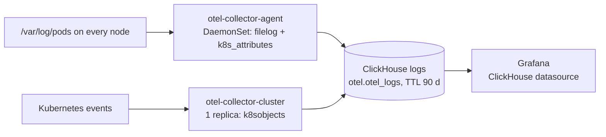

# Cluster logs: OpenTelemetry -> ClickHouse -> Grafana

Every container log line and every Kubernetes event lands in ClickHouse, and Grafana queries it
through the ClickHouse datasource. Traefik writes JSON access logs to stdout, so ingress
requests (host, path, status, duration, backend) are in the same store. Decision record:
ADR-019 in `docs/project_notes/decisions.md`.



| Piece | Where | Wave |
|---|---|---|
| Passwords of the ClickHouse users `otel` and `grafana` | `charts/clickhouse-dependencies` (OnePasswordItems) | 8 |
| Grafana plugin, datasource `ClickHouse` (uid `clickhouse-logs`) | `charts/addons/templates/kube-prometheus-stack.yaml` | 9 |
| Altinity clickhouse-operator (CRDs, metrics exporter, ServiceMonitor, dashboards) | `charts/addons/templates/logging.yaml` | 10 |
| `ClickHouseInstallation/logs` on `STORAGE_CLASS_ISCSI_SSD`, dashboard "Cluster logs" | `charts/clickhouse` | 11 |
| `otel-collector-agent` (DaemonSet) and `otel-collector-cluster` (events) | `charts/addons/templates/logging.yaml` | 12 |

Everything runs in namespace `observability` (PodSecurity `privileged`: the agent mounts
`/var/log/pods` and `/var/lib/otelcol` from the host and runs as root because Talos writes
container logs root-owned `0640`). Versions: `configuration/versions.yaml` keys
`opentelemetry-collector`, `altinity-clickhouse-operator`, `clickhouse-server`,
`grafana-clickhouse-datasource`.

## 1Password items (homelab)

| Item (`configuration/` key) | Field | Used by |
|---|---|---|
| `clickhouse-otel` (`CLICKHOUSE_OTEL_1P_PATH`) | `password` | ClickHouse user `otel` (writer), the collectors |
| `clickhouse-grafana` (`CLICKHOUSE_GRAFANA_1P_PATH`) | `password` | ClickHouse user `grafana` (read-only), the Grafana datasource |

Create both before the first sync; Grafana does not start without Secret
`monitoring/clickhouse-grafana`. Generate each with `openssl rand -base64 32`. Kind seeds
throwaway values from `localdev/fakes/secrets.yaml`.

## Query logs in Grafana

- **Dashboards -> "Cluster logs"**: log volume per namespace, Traefik requests
  that returned 5xx or took longer than 1 s, and a log panel filtered by namespace and a
  "Contains" search box.
- **Explore -> ClickHouse**: switch the query type to *Logs*; the OpenTelemetry mode already
  points at `otel.otel_logs`. SQL works as well:

```sql
-- last 15 minutes of one app
SELECT Timestamp, Body
FROM otel.otel_logs
WHERE Timestamp > now() - INTERVAL 15 MINUTE
  AND ResourceAttributes['k8s.namespace.name'] = 'paperclip'
ORDER BY Timestamp DESC LIMIT 200;

-- slow or failing requests to one host, from the Traefik access log
SELECT Timestamp,
       JSONExtractString(Body, 'RequestPath') AS path,
       JSONExtractInt(Body, 'DownstreamStatus') AS status,
       JSONExtractFloat(Body, 'Duration') / 1e6 AS ms
FROM otel.otel_logs
WHERE ResourceAttributes['k8s.namespace.name'] = 'traefik'
  AND JSONExtractString(Body, 'RequestHost') LIKE 'paperclip.%'
  AND (status >= 500 OR ms > 1000)
ORDER BY Timestamp DESC LIMIT 200;
```

Useful resource attributes: `k8s.namespace.name`, `k8s.pod.name`, `k8s.container.name`,
`k8s.deployment.name`, `k8s.node.name`. `ServiceName` is the pod's `service.name` if it sets
one, otherwise the container name. Events from `otel-collector-cluster` carry the event
object as JSON in `Body`.

## Retention (90 days)

The ClickHouse exporter creates `otel.otel_logs` on first start (`create_schema: true`) with
`TTL TimestampTime + toIntervalDay(90)` from `logging.retention: 2160h` in
`configuration/templates/helm-addons.tmpl`; ClickHouse drops expired parts during merges. The
exporter only sets the TTL when it creates the table, so changing `retention` later also needs:

```sql
ALTER TABLE otel.otel_logs MODIFY TTL TimestampTime + toIntervalDay(<days>);
```

Check the current TTL with `SELECT engine_full FROM system.tables WHERE name = 'otel_logs'`
(the `logging` e2e test asserts it is set). The volume is 50Gi in homelab; the chart's
`KubePersistentVolumeFillingUp` alert warns before it fills.

## Operate

```bash
kubectl -n observability get chi,pods
kubectl -n observability exec -it chi-logs-logs-0-0-0 -- clickhouse-client \
  --query "SELECT count(), min(Timestamp) FROM otel.otel_logs"
```

Alerts (`homelab-logging`, `homelab-ingress`): [runbooks/alerting.md](runbooks/alerting.md).
Dashboards: "OpenTelemetry Collector" (grafana.com 15983), "Traefik Official Kubernetes
Dashboard" (17347) and the Altinity ClickHouse dashboards shipped by the operator chart.
