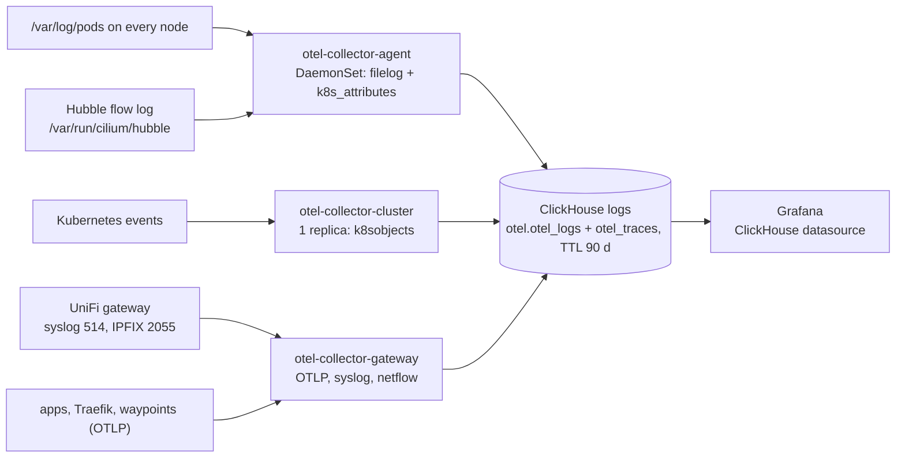

# Cluster logs: OpenTelemetry -> ClickHouse -> Grafana

Every container log line, every Kubernetes event, the filtered Hubble flow log, the UniFi
gateway's syslog and NetFlow/IPFIX records and OTLP logs from applications land in ClickHouse,
and Grafana queries them through the ClickHouse datasource. Traefik writes JSON access logs to
stdout, so ingress requests (client, host, path, status, durations, backend, TraceId) are in the
same store. Traces: docs/tracing.md. Decision records: ADR-019, ADR-021.



| Piece | Where | Wave |
|---|---|---|
| Passwords of the ClickHouse users `otel` and `grafana` | `charts/clickhouse-dependencies` (OnePasswordItems) | 8 |
| Grafana plugin, datasource `ClickHouse` (uid `clickhouse-logs`) | `charts/addons/templates/kube-prometheus-stack.yaml` | 9 |
| Altinity clickhouse-operator (CRDs, metrics exporter, ServiceMonitor, dashboards) | `charts/addons/templates/logging.yaml` | 10 |
| `ClickHouseInstallation/logs` on `STORAGE_CLASS_ISCSI_SSD`, dashboard "Cluster logs" | `charts/clickhouse` | 11 |
| `otel-collector-agent` (DaemonSet), `otel-collector-cluster` (events), `otel-collector-gateway` (OTLP, UniFi) | `charts/addons/templates/logging.yaml` | 12 |

Everything runs in namespace `observability` (PodSecurity `privileged`: the agent mounts
`/var/log/pods` and `/var/lib/otelcol` from the host and runs as root because Talos writes
container logs root-owned `0640`). Versions: `configuration/versions.yaml` keys
`opentelemetry-collector`, `altinity-clickhouse-operator`, `clickhouse-server`,
`grafana-clickhouse-datasource`.

## 1Password items (homelab)

| Item (`configuration/` key) | Field | Used by |
|---|---|---|
| `clickhouse-otel` (`CLICKHOUSE_OTEL_1P_PATH`) | `password` | ClickHouse user `otel` (writer), the collectors |
| `clickhouse-grafana` (`CLICKHOUSE_GRAFANA_1P_PATH`) | `password` | ClickHouse user `grafana` (read-only), the Grafana datasource |

Create both before the first sync; Grafana does not start without Secret
`monitoring/clickhouse-grafana`. Generate each with `openssl rand -base64 32`. Kind seeds
throwaway values from `localdev/fakes/secrets.yaml`.

## Query logs in Grafana

- **Dashboards -> "Cluster logs"**: log volume per namespace, Traefik requests
  that returned 5xx or took longer than 1 s, and a log panel filtered by namespace and a
  "Contains" search box.
- **Explore -> ClickHouse**: switch the query type to *Logs*; the OpenTelemetry mode already
  points at `otel.otel_logs`. SQL works as well:

```sql
-- last 15 minutes of one app
SELECT Timestamp, Body
FROM otel.otel_logs
WHERE Timestamp > now() - INTERVAL 15 MINUTE
  AND ResourceAttributes['k8s.namespace.name'] = 'paperclip'
ORDER BY Timestamp DESC LIMIT 200;

-- slow or failing requests to one host, from the Traefik access log
SELECT Timestamp,
       JSONExtractString(Body, 'RequestPath') AS path,
       JSONExtractInt(Body, 'DownstreamStatus') AS status,
       JSONExtractFloat(Body, 'Duration') / 1e6 AS ms
FROM otel.otel_logs
WHERE ResourceAttributes['k8s.namespace.name'] = 'traefik'
  AND JSONExtractString(Body, 'RequestHost') LIKE 'paperclip.%'
  AND (status >= 500 OR ms > 1000)
ORDER BY Timestamp DESC LIMIT 200;
```

Useful resource attributes: `k8s.namespace.name`, `k8s.pod.name`, `k8s.container.name`,
`k8s.deployment.name`, `k8s.node.name`. `ServiceName` is the pod's `service.name` if it sets
one, otherwise the container name. Events from `otel-collector-cluster` carry the event
object as JSON in `Body`.

## Retention (90 days)

The ClickHouse exporter creates `otel.otel_logs` on first start (`create_schema: true`) with
`TTL TimestampTime + toIntervalDay(90)` from `logging.retention: 2160h` in
`configuration/templates/helm-addons.tmpl`; ClickHouse drops expired parts during merges. The
exporter only sets the TTL when it creates the table, so changing `retention` later also needs:

```sql
ALTER TABLE otel.otel_logs MODIFY TTL TimestampTime + toIntervalDay(<days>);
```

Check the current TTL with `SELECT engine_full FROM system.tables WHERE name = 'otel_logs'`
(the `logging` e2e test asserts it is set; `otel_traces` gets the same TTL).

**Sizing (100Gi in homelab).** Estimate for 90 days, ClickHouse compressing text about 8-10x:
container logs ~2-4 GB/day raw -> 20-40 GB; Traefik access logs are part of that; Hubble flow
log (paperclip + traefik + drops) ~0.2 GB/day -> ~2 GB; UniFi IPFIX for a home network,
~50k flows/h at ~60 B compressed -> ~6 GB; traces at 10 % sampling -> a few GB. Total ~35-55 GB,
so 100Gi leaves headroom. Measure the real rate after a week:

```sql
SELECT table, formatReadableSize(sum(bytes_on_disk)) AS size, min(min_date), max(max_date)
FROM system.parts WHERE database = 'otel' AND active GROUP BY table;
```

`KubePersistentVolumeFillingUp` (chart default rule) warns before the volume fills; grow the
PVC (iSCSI class supports expansion) or shorten `logging.retention`.

## UniFi gateway (syslog and NetFlow)

The `unifi-gateway` Terragrunt unit provisions the exports when `LOGGING_ENABLED` is `"true"`
(the default; the same key turns the log pipeline on in `charts/addons`), pointing them at
`OTEL_LB_IP` whether or not the collector is up yet:

| Setting (controller key) | Terraform | Values |
|---|---|---|
| Activity logging, SIEM server (`rsyslogd`) | `unifi_setting.syslog` (`ubiquiti-community/unifi` >= 0.53) | enabled, `OTEL_LB_IP`:514, all categories; the "this controller" flags stay on |
| NetFlow (`netflow`) | `terraform_data.netflow` running `scripts/unifi-setting.ts apply netflow` | enabled, `OTEL_LB_IP`:2055, version 10 (IPFIX), `network_ids` = every enabled corporate and guest network (`--all-networks`, required by the controller); sampling untouched |

```bash
task tf:init:component COMPONENT=unifi-gateway TF_ARGS=-upgrade   # once: provider 0.41 -> 0.56
task tf:plan:component COMPONENT=unifi-gateway
task tf:apply:component COMPONENT=unifi-gateway
```

The Taskfile exports `configuration/resolved.json` (gitignored) before each `tf:*` task; the unit
reads `LOGGING_ENABLED` and `OTEL_LB_IP` from it. The provider has no NetFlow setting, so the
script logs in to the console and merges the fields into the `netflow` setting (ADR-024); it runs
again only when those values change, so a NetFlow edit made in the UI is not reverted until
then. `op run --env-file=.env.op -- bun scripts/unifi-setting.ts get netflow --insecure` shows
the live values. Turning the flag off stops managing both settings and leaves the gateway as it
is. Neither setting has a source interface: the gateway sends from `GATEWAY_IP`, its address on
the homelab VLAN, because `OTEL_LB_IP` is in that subnet (inside `loadBalancerSourceRanges`).

The UI paths below are the manual fallback, for example to add per-rule firewall logging.

What UniFi Network exports ([UniFi System Logs & SIEM Integration](https://help.ui.com/hc/en-us/articles/33349041044119-UniFi-System-Logs-SIEM-Integration),
[Traffic Flows and Traffic Logging](https://help.ui.com/hc/en-us/articles/32201256219799-Traffic-Flows-and-Traffic-Logging-in-UniFi-Network)):

| Export | UI path (UniFi Network 9.x) | Protocol / format | Target here |
|---|---|---|---|
| Activity logging (system, admin, client, IDS/IPS) | Settings -> Control Plane -> Integrations -> Activity Logging (Syslog) -> SIEM Server | CEF inside syslog, UDP | `OTEL_LB_IP`, port 514 |
| Firewall and traffic logs | Settings -> CyberSecure -> Traffic Logging -> Activity Logging (Syslog) -> SIEM Server; per-rule "Syslog Logging" in Settings -> Policy Engine | syslog, UDP | `OTEL_LB_IP`, port 514 |
| Flow records | Settings -> CyberSecure -> Traffic Logging -> NetFlow (IPFIX) | IPFIX (NetFlow v10), UDP, sampled | `OTEL_LB_IP`, port 2055 |

The fields take an IP address, so enter `OTEL_LB_IP` rather than `otel.<DOMAIN>` (the name
resolves to the same address for everything else). Community reports for Network 9.3.x mention
the IPFIX export sending only templates; `HomelabUniFiTelemetrySilent` fires if nothing arrives.

The gateway collector listens on 5514 (syslog, UDP and TCP, RFC 3164) and 2055 (NetFlow v5/v9,
IPFIX) behind the Service ports 514 and 2055 of the LoadBalancer `otel-collector-gateway`
(`io.cilium/lb-ipam-ips: OTEL_LB_IP`, external-dns `otel.<DOMAIN>`), which also serves OTLP
4317/4318. `loadBalancerSourceRanges` limits it to the LAN (`NFS_SHARE_ALLOW`); Cilium enforces
it at the load balancer before any NAT. There is no authentication on syslog or NetFlow, so the
address stays internal: never forward these ports on the gateway. The Service keeps
`externalTrafficPolicy: Cluster` (the L2 announcement and BGP speakers are not the nodes running
the collector), so the source address seen by the collector is a node's; the syslog message
carries the gateway's hostname and flow records carry the flow's own addresses.

Records: syslog lines get ServiceName `unifi-syslog`, the CEF header in `LogAttributes`
(`cef_vendor`, `cef_product`, `cef_name`, `cef_severity`, `cef_extension`); flows come from
scope `netflowreceiver` with `source.address`, `source.port`, `destination.address`,
`destination.port`, `network.transport`, `flow.io.bytes`, `flow.io.packets`, `flow.start`,
`flow.end`. Dashboard: "UniFi gateway flows and firewall" (top talkers, ports, denies).

## Operate

```bash
kubectl -n observability get chi,pods
kubectl -n observability exec -it chi-logs-logs-0-0-0 -- clickhouse-client \
  --query "SELECT count(), min(Timestamp) FROM otel.otel_logs"
```

Alerts (`homelab-logging`, `homelab-ingress`): [runbooks/alerting.md](runbooks/alerting.md).
Paperclip end to end: [runbooks/paperclip-request-path.md](runbooks/paperclip-request-path.md).
Dashboards: "OpenTelemetry Collector" (grafana.com 15983), "Traefik Official Kubernetes
Dashboard" (17347) and the Altinity ClickHouse dashboards shipped by the operator chart.
