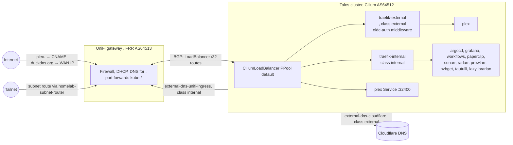
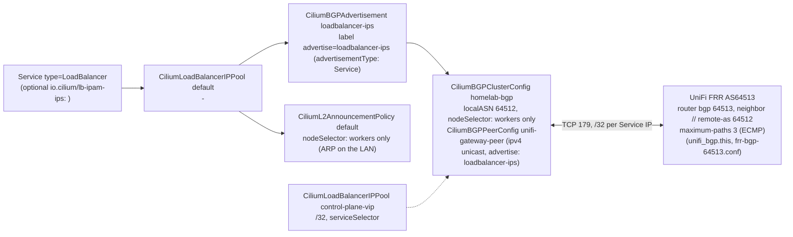
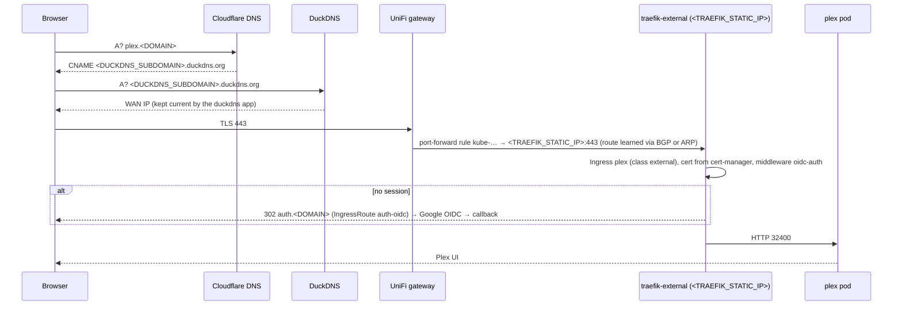
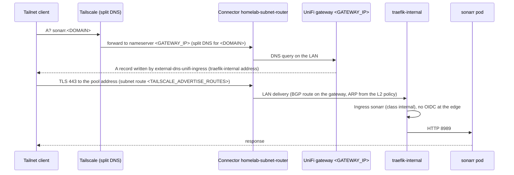

# Networking

How traffic reaches the cluster and how names resolve, from the repository as it is today:
Cilium load balancing with BGP to the UniFi gateway, two Traefik ingress lanes, two
external-dns providers, the port-forwarding controller, and Tailscale for remote access.

Addresses and hostnames are `<KEY>` placeholders resolved from the gitignored
`configuration/environments/homelab.yaml` (`configuration/schema/network.schema.yaml`
declares them; `task config:eval` prints them). Purely illustrative addresses use the
RFC 5737 range `192.0.2.0/24`. Load balancing is Cilium; there is no separate load-balancer
add-on.

## Table of Contents

- [Overview](#overview)
- [Load balancing: Cilium LB IPAM and BGP](#load-balancing-cilium-lb-ipam-and-bgp)
- [Ingress: two Traefiks](#ingress-two-traefiks)
- [Ingress inventory](#ingress-inventory)
- [DNS: external-dns](#dns-external-dns)
- [Port forwarding](#port-forwarding)
- [Tailscale](#tailscale)
- [Request paths](#request-paths)
- [Cilium CNI](#cilium-cni)
- [Troubleshooting](#troubleshooting)
- [References](#references)

---

## Overview



| Component | Role | Where |
|-----------|------|-------|
| UniFi gateway | Router, firewall, DHCP, LAN DNS for `<DOMAIN>`, BGP peer (FRR, AS `<BGP_ROUTER_ASN>` = 64513) | `terragrunt/modules/unifi-gateway` |
| Cilium | CNI, kube-proxy replacement, LoadBalancer IPAM, BGP speaker (AS 64512), L2 announcements | `charts/addons/templates/cilium.yaml`, `cilium-lb-ipam.yaml` |
| Traefik ×2 | `external` lane (Internet, OIDC) and `internal` lane (LAN + tailnet) | `charts/addons/templates/traefik-external.yaml`, `traefik-internal.yaml` |
| cert-manager | Let's Encrypt via Cloudflare DNS-01 (`CERT_ISSUER=letsencrypt`) | `charts/addons/templates/cert-manager.yaml`, `charts/cert-manager-cluster-issuer` |
| external-dns | Cloudflare records for the external lane, UniFi records for the internal lane | `charts/addons/templates/external-dns-*.yaml` |
| duckdns | Keeps `<DUCKDNS_SUBDOMAIN>.duckdns.org` on the current WAN address | `charts/applications/templates/duckdns.yaml`, `charts/duckdns` |
| port-forwarding-controller | Creates UniFi port forwards from annotated Services | `charts/addons/templates/unifi-port-forward.yaml` |
| Tailscale operator | Subnet router, API server proxy, split DNS | `charts/addons/templates/tailscale-operator.yaml`, `charts/tailscale-config` |

---

## Load balancing: Cilium LB IPAM and BGP



`charts/addons/templates/cilium-lb-ipam.yaml` renders every load-balancing CR:

| Resource | Name | What it does |
|----------|------|--------------|
| `CiliumLoadBalancerIPPool` | `default` | Allocates `<LB_POOL_START>`-`<LB_POOL_END>` to `LoadBalancer` Services; a Service pins an address with `io.cilium/lb-ipam-ips` (Traefik external: `<TRAEFIK_STATIC_IP>`, Plex: `<PLEX_LB_IP>`) |
| `CiliumLoadBalancerIPPool` | `control-plane-vip` | A one-address pool for `<CP_VIP>` selected by `serviceSelector`, for a Service that opts in with the `cilium.io/pool: control-plane-vip` label |
| `CiliumBGPClusterConfig` | `homelab-bgp` | Local AS `64512`; runs on the workers only (`nodeSelector` control-plane `DoesNotExist`, the same selector as the L2 policy), peering with every entry in `cilium-lb-ipam.bgp.peers` (`<BGP_PEER_IP>` = `<GATEWAY_IP>`, AS `<BGP_ROUTER_ASN>`) |
| `CiliumBGPPeerConfig` | `unifi-gateway-peer` | Timers, graceful restart and the `ipv4/unicast` family; `families[].advertisements` selects `CiliumBGPAdvertisement`s labelled `advertise: loadbalancer-ips` (without it Cilium advertises nothing) |
| `CiliumBGPAdvertisement` | `loadbalancer-ips` | Labelled `advertise: loadbalancer-ips`; advertises every Service LoadBalancer address as a /32 from each worker (`externalTrafficPolicy: Local` Services such as Plex only from workers with a local endpoint) |
| `CiliumL2AnnouncementPolicy` | `default` | Workers answer ARP for the pool addresses on the LAN interface, so LAN clients reach them even without the BGP route |

The other end of the session is written by Terragrunt: the `unifi-gateway` unit renders
`frr-bgp.conf.tftpl` (`router bgp 64513`, one `neighbor <node ip> remote-as 64512` per
worker, `soft-reconfiguration inbound`, `maximum-paths` = number of neighbors so the gateway
installs an ECMP route across every worker advertising a /32) and uploads it with the `unifi_bgp` resource
(`task tf:apply:component COMPONENT=unifi-gateway`). Private ASNs per RFC 6996.

In Kind `LOAD_BALANCER_ENABLED=false`: Services are NodePort, none of these CRs render.

---

## Ingress: two Traefiks

Two independent Traefik releases from the same chart (`charts.traefik`) with their own
IngressClass, so a workload is either reachable from the Internet or only from the LAN and
tailnet, never by accident both (design: `docs/plans/2026-02-13-dual-traefik-ingress-design.md`).

| | `traefik-external` | `traefik-internal` |
|--|--------------------|--------------------|
| IngressClass | `external` (`INGRESS_CLASS_EXTERNAL`) | `internal` (`INGRESS_CLASS_INTERNAL`) |
| Service address | `<TRAEFIK_STATIC_IP>` (`io.cilium/lb-ipam-ips`), `externalTrafficPolicy: Cluster` | from the `default` pool |
| Reached from | Internet through the UniFi port forward `kube-*` on 80/443, and the LAN | LAN and tailnet only; no port forward, no public DNS |
| DNS | Cloudflare (`external-dns-cloudflare`, `--ingress-class=external`) | UniFi (`external-dns-unifi-ingress`, `--ingress-class=internal`) |
| Authentication | `Middleware oidc-auth` (`traefikoidc` plugin, `charts.traefik-oidc`): Google OIDC, `allowedDomains` from `TRAEFIK_OIDC_ALLOWED_DOMAINS`, sessions in `oidc-redis`; callback host `auth.<DOMAIN>` (`IngressRoute auth-oidc`) | none at the edge; apps authenticate themselves |
| Dashboard | `IngressRoute` on `<TRAEFIK_HOSTNAME>` (`traefik.<DOMAIN>`) | `IngressRoute` on `<TRAEFIK_INTERNAL_HOSTNAME>` (`traefik-internal.<DOMAIN>`) |
| Child charts | `traefik-external-dependencies` (OnePasswordItems: OAuth client, session key), `traefik-external-config` (middleware, `auth-tls` Certificate, `auth-dns` DNSEndpoint, dashboard route) | `traefik-internal-dependencies`, `traefik-internal-config` |

`oauth2-proxy` has a template in `charts/addons` but is disabled everywhere
(`oauth2-proxy.enabled: false`); the OIDC lane is the Traefik plugin. Certificates come from
cert-manager's `letsencrypt` ClusterIssuer (Cloudflare DNS-01); Kind uses a self-signed
issuer of the same name (`CERT_ISSUER=selfsigned`). No Gateway API resources exist.

Every application Ingress sets `ingressClassName` from `global.ingressClassNameExternal` /
`global.ingressClassNameInternal` in the rendered values; Plex is the only external one.

---

## Ingress inventory

Generated from `tests/snapshots/homelab/*.yaml` by `task docs:check -- --fix`
(`scripts/docs-check.ts`); do not edit by hand. The `argocd` row comes from
`charts/bootstrap` (plain Helm), every other one from `charts/addons` or
`charts/applications`.

<!-- docs-check:begin ingress-table -->
| Host | Class | Kind | Application |
| --- | --- | --- | --- |
| `auth.<DOMAIN>` | external | IngressRoute | `auth-oidc` |
| `plex.<DOMAIN>` | external | Ingress | `plex` |
| `traefik.<DOMAIN>` | external | IngressRoute | `traefik-external` |
| `alertmanager.<DOMAIN>` | internal | Ingress | `kube-prometheus-stack` |
| `argocd.<DOMAIN>` | internal | Ingress | `argocd` |
| `grafana.<DOMAIN>` | internal | Ingress | `kube-prometheus-stack` |
| `hubble.<DOMAIN>` | internal | Ingress | `cilium-config` |
| `lazylibrarian.<DOMAIN>` | internal | Ingress | `lazylibrarian` |
| `nzbget.<DOMAIN>` | internal | Ingress | `nzbget` |
| `otel.<DOMAIN>` | internal | Ingress | `otel-collector-gateway` |
| `otlp.<DOMAIN>` | internal | Ingress | `otel-collector-gateway` |
| `paperclip.<DOMAIN>` | internal | Ingress | `paperclip` |
| `prowlarr.<DOMAIN>` | internal | Ingress | `prowlarr` |
| `radarr.<DOMAIN>` | internal | Ingress | `radarr` |
| `servicemesh.<DOMAIN>` | internal | Ingress | `istio-config` |
| `sonarr.<DOMAIN>` | internal | Ingress | `sonarr` |
| `tautulli.<DOMAIN>` | internal | Ingress | `tautulli` |
| `traefik-internal.<DOMAIN>` | internal | IngressRoute | `traefik-internal` |
| `workflows.<DOMAIN>` | internal | Ingress | `argo-workflows` |
<!-- docs-check:end ingress-table -->

Three external hosts (Plex, the external dashboard, the OIDC callback) and eleven internal
ones. Previews (`<app>-pr<N>.<DOMAIN>`, ADR-013) render on the same classes as their app and
are not part of the snapshot.

---

## DNS: external-dns

Four `external-dns` Applications (chart `charts.external-dns`), two per lane, each with its
own `txtOwnerId` so they never fight over records:

| Application | Provider | Sources | Selects | Target |
|-------------|----------|---------|---------|--------|
| `external-dns-cloudflare` | cloudflare (`proxied` from values) | `ingress` | `--ingress-class=external` plus an `annotationFilter` | `--default-targets=<EXTERNAL_DNS_DEFAULT_TARGET>` (`<DUCKDNS_SUBDOMAIN>.duckdns.org`), so public names are **CNAMEs to the DuckDNS name**, never the LAN address |
| `external-dns-cloudflare-crd` | cloudflare | `crd` (`DNSEndpoint`) | explicit records such as `auth-dns` from `traefik-external-config` | same default target |
| `external-dns-unifi-ingress` | UniFi webhook (`charts.external-dns-webhook-unifi`) | `ingress`, `service` | `--ingress-class=internal` | the Ingress/Service LoadBalancer address on the LAN |
| `external-dns-unifi-crd` | UniFi webhook | `crd` | `DNSEndpoint` records for the LAN (`charts/external-dns-config`) | as declared |

The `duckdns` Application (`charts/duckdns`, token from `duckdns-dependencies`) refreshes
`<DUCKDNS_SUBDOMAIN>.duckdns.org` with the current WAN address, which is why the Cloudflare
records can be static CNAMEs. `EXTERNAL_DNS_ENABLED=false` in Kind renders none of this;
e2e tests send `Host:` headers instead.

Resolution therefore depends on where the client sits:

| Client | `plex.<DOMAIN>` resolves to | Internal names (`sonarr.<DOMAIN>`, ...) |
|--------|-----------------------------|------------------------------------------|
| Internet | Cloudflare → CNAME DuckDNS → WAN IP → port forward → `<TRAEFIK_STATIC_IP>` | NXDOMAIN (no public record) |
| LAN | UniFi answers first (`external-dns-unifi`), otherwise the public CNAME; either way ends at Traefik external | UniFi → `traefik-internal` address |
| Tailnet | Split DNS sends `<DOMAIN>` to `<GATEWAY_IP>` through the subnet router, same answers as the LAN | same as LAN |

---

## Port forwarding

`port-forwarding-controller` (chart `unifi-port-forward`, `charts.unifi-port-forward`;
credentials from `charts/port-forwarding-controller-config`) watches Services annotated
`port-forwarding.<DOMAIN>/enable: "true"` and creates the matching UniFi port-forward rules,
named with the `kube-` prefix so hand-made rules are never touched. Two Services carry the
annotation:

| Service | Address | Ports | Purpose |
|---------|---------|-------|---------|
| `traefik-external` | `<TRAEFIK_STATIC_IP>` | 80, 443 | Public ingress (Plex UI, OIDC callback, dashboard) |
| `plex` (`externalTrafficPolicy: Local`) | `<PLEX_LB_IP>` | 32400 | Plex remote access direct to the media server |

Removing the annotation (or the Service) removes the rule. Nothing else is exposed: the
internal lane, ArgoCD and the API server have no forward.

---

## Tailscale

The Tailscale operator (`charts.tailscale-operator`, OAuth client from
`charts/tailscale-config` OnePasswordItem `operator-oauth`) provides three things:

| Piece | Resource | Notes |
|-------|----------|-------|
| Subnet router | `Connector homelab-subnet-router`, `advertiseRoutes: [<TAILSCALE_ADVERTISE_ROUTES>]` (the LAN /24) | Tailnet clients reach every LAN address, including the load-balancer pool, without a VPN concentrator |
| API server proxy | operator `apiServerProxyConfig.mode: noauth`, hostname `tailscale-operator-homelab` | Kubernetes API over the tailnet with the caller's own credentials; the read-only agent path (`task prod:kubeconfig`, ServiceAccount `agent-readonly`, ADR-013) uses it: [runbooks/readonly-access.md](./runbooks/readonly-access.md) |
| Split DNS | tailnet nameserver for `<DOMAIN>` = `<GATEWAY_IP>`, applied with `task tailscale:dns:apply` (`scripts/tailscale-dns.ts`) | Internal names resolve on the tailnet exactly as on the LAN: [runbooks/tailscale-dns.md](./runbooks/tailscale-dns.md) |

The tailnet ACL is SOPS-encrypted in `policy.sops.hujson` and applied by
`.github/workflows/tailscale-acl.yml` with a dedicated ACL-only age key.

---

## Request paths

### Internet → Plex



Plex clients can also connect straight to `<PLEX_LB_IP>:32400` through the second port
forward, which is what Plex "remote access" uses.

### Tailnet → internal ingress



The same path serves the LAN without the first two hops. Nothing on the internal lane has a
public record or a port forward, so the only ways in are the LAN, the tailnet, and the
API server proxy.

---

## Cilium CNI

Cilium is the CNI on Talos (rendered as an inline manifest by `task render` for first boot,
then owned by the `cilium` ArgoCD Application at `charts.cilium`): eBPF datapath, kube-proxy
replacement, network policy (`tests/e2e/cilium-netpol` proves enforcement in Kind), and the
load-balancing CRs above. In Kind the same chart and values are installed by
`scripts/localdev-kind.ts` and adopted by the Application on first sync.

---

## Troubleshooting

### BGP session down or LoadBalancer IP unreachable

```bash
# Cilium side (exec into a worker's cilium pod: control planes run no BGP speaker)
kubectl -n kube-system exec ds/cilium -- cilium bgp peers
kubectl -n kube-system exec ds/cilium -- cilium bgp routes advertised ipv4 unicast
kubectl get ciliumloadbalancerippools,ciliumbgpclusterconfigs,ciliumbgpadvertisements,ciliuml2announcementpolicies
kubectl get svc -A | rg LoadBalancer

# Gateway side (FRR on the UniFi gateway)
ssh admin@<GATEWAY_IP>
vtysh -c "show ip bgp summary"          # one established neighbor per worker, AS 64512, PfxRcd > 0
vtysh -c "show ip bgp"                  # /32 per Service address
vtysh -c "show ip route bgp"            # Cluster-policy /32s list one nexthop per worker (ECMP)
```

Illustrative `show ip bgp summary` (RFC 5737 addresses):

```
Neighbor        V    AS   MsgRcvd MsgSent   TblVer  InQ OutQ  Up/Down State/PfxRcd
192.0.2.21      4 64512      123     456        0    0    0 01:23:45        5
192.0.2.22      4 64512      234     567        0    0    0 01:23:45        5
192.0.2.23      4 64512      345     678        0    0    0 01:23:45        5
```

Check the ASNs match (`cilium-lb-ipam.bgp` values vs `BGP_ROUTER_ASN`), that TCP 179 is
allowed between the workers and `<GATEWAY_IP>`, and that the FRR file uploaded by
`unifi-gateway` lists the current worker addresses (`task tf:plan:component
COMPONENT=unifi-gateway` shows drift after a node recreate).

### Ingress not answering

```bash
kubectl -n traefik get pods,svc                      # both Traefiks Running, external has <TRAEFIK_STATIC_IP>
kubectl get ingress -A                               # class external/internal, ADDRESS filled
kubectl get ingressroute -A
kubectl -n media get ingress plex -o yaml
curl -kI https://plex.<DOMAIN>                       # from outside
curl -kI --resolve sonarr.<DOMAIN>:443:<traefik-internal address> https://sonarr.<DOMAIN>/ping   # from the LAN
kubectl -n traefik logs deploy/traefik-external | rg -i 'oidc|error'
```

Ingress objects show `Progressing` forever only when no LoadBalancer address arrives; the
custom health Lua in `charts/bootstrap/files/health/` marks them Healthy otherwise.

### DNS records missing or wrong

```bash
kubectl -n external-dns logs deploy/external-dns-cloudflare | rg -i 'plex|error'
kubectl -n external-dns-unifi logs deploy/external-dns-unifi-ingress | rg -i 'sonarr|error'
kubectl get dnsendpoints -A
dig +short plex.<DOMAIN>                       # CNAME to <DUCKDNS_SUBDOMAIN>.duckdns.org
dig +short @<GATEWAY_IP> sonarr.<DOMAIN>       # LAN answer from UniFi
kubectl -n duckdns logs -l app.kubernetes.io/name=duckdns | tail
```

An external record pointing at a LAN address means `--default-targets` is missing from the
Cloudflare instance; an internal name resolving publicly means an Ingress is on the wrong
class.

### Port forward missing

```bash
kubectl -n port-forwarding get pods
kubectl -n port-forwarding logs deploy/port-forwarding-controller | rg -i 'kube-|error'
kubectl -n media get svc plex -o jsonpath='{.metadata.annotations}'
```

### Tailnet cannot reach the LAN

```bash
kubectl -n tailscale get connector homelab-subnet-router -o yaml   # status: routes advertised and approved
kubectl -n tailscale get pods
tailscale status                                                  # on the client: subnet router online
dig +short sonarr.<DOMAIN>                                        # split DNS → LAN answer
task tailscale:dns:status
```

The subnet route must be approved in the Tailscale admin console once; on macOS never run
`tailscale down` from a standalone app install (it strands the backend).

### Pod connectivity and DNS

```bash
kubectl run -it --rm debug --image=nicolaka/netshoot --restart=Never -- bash
#   nslookup kubernetes.default.svc.cluster.local ; curl -I https://1.1.1.1
kubectl -n kube-system get pods -l k8s-app=cilium
kubectl -n kube-system exec ds/cilium -- cilium status
kubectl get ciliumnetworkpolicies,networkpolicies -A
```

---

## References

- [Cilium LB IPAM](https://docs.cilium.io/en/stable/network/lb-ipam/), [Cilium BGP control plane](https://docs.cilium.io/en/stable/network/bgp-control-plane/), [Cilium L2 announcements](https://docs.cilium.io/en/stable/network/l2-announcements/)
- [Traefik](https://doc.traefik.io/traefik/), [traefikoidc plugin](https://github.com/lukaszraczylo/traefikoidc)
- [external-dns](https://kubernetes-sigs.github.io/external-dns/), [external-dns UniFi webhook](https://github.com/kashalls/external-dns-unifi-webhook)
- [port-forwarding-controller](https://github.com/ryanmcafee/port-forwarding-controller)
- [Tailscale Kubernetes operator](https://tailscale.com/kb/1236/kubernetes-operator), [UniFi BGP](https://help.ui.com/hc/en-us/articles/4407211598612-UniFi-Gateway-BGP)
- In this repo: [architecture.md](./architecture.md), [applications.md](./applications.md),
  [hardware.md](./hardware.md), [runbooks/readonly-access.md](./runbooks/readonly-access.md),
  [runbooks/tailscale-dns.md](./runbooks/tailscale-dns.md), `docs/plans/2026-02-13-dual-traefik-ingress-design.md`
