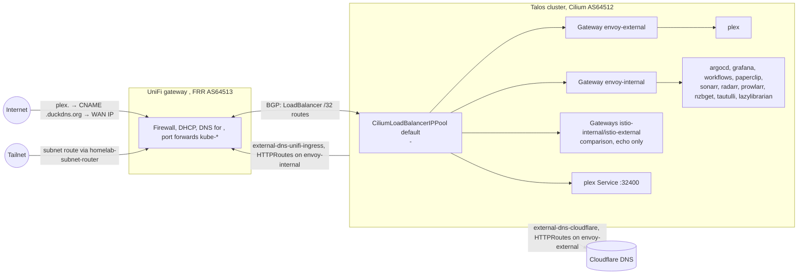
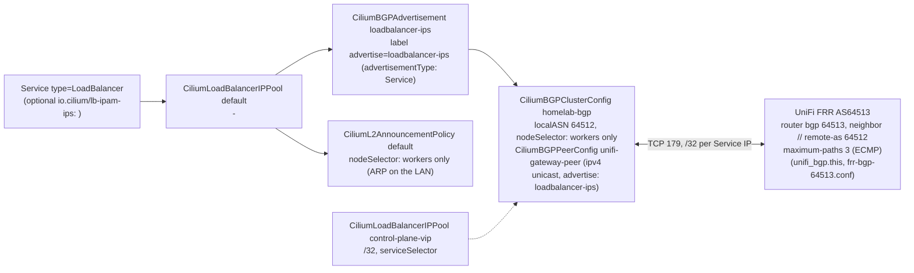
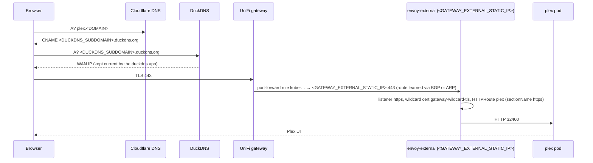
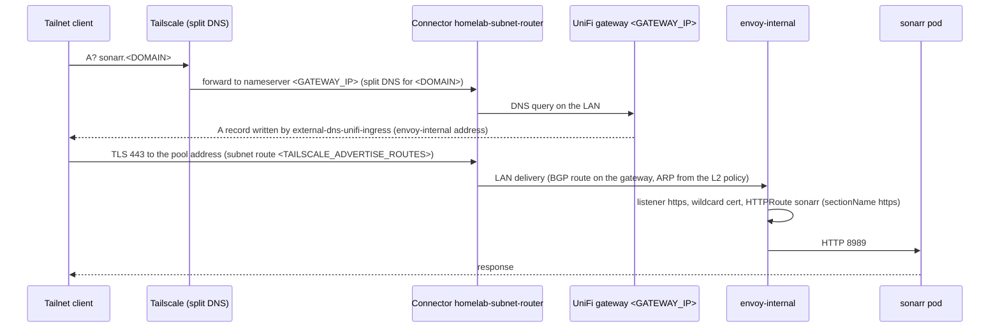

# Networking

How traffic reaches the cluster and how names resolve, from the repository as it is today:
Cilium load balancing with BGP to the UniFi gateway, two Envoy Gateway Gateways, two
external-dns providers, the port-forwarding controller, and Tailscale for remote access.

Addresses and hostnames are `<KEY>` placeholders resolved from the gitignored
`configuration/environments/homelab.yaml` (`configuration/schema/network.schema.yaml`
declares them; `task config:eval` prints them). Purely illustrative addresses use the
RFC 5737 range `192.0.2.0/24`. Load balancing is Cilium; there is no separate load-balancer
add-on.

## Table of Contents

- [Overview](#overview)
- [Load balancing: Cilium LB IPAM and BGP](#load-balancing-cilium-lb-ipam-and-bgp)
- [Ingress: Envoy Gateway](#ingress-envoy-gateway)
- [Route inventory](#route-inventory)
- [DNS: external-dns](#dns-external-dns)
- [Port forwarding](#port-forwarding)
- [Tailscale](#tailscale)
- [Request paths](#request-paths)
- [Cilium CNI](#cilium-cni)
- [Troubleshooting](#troubleshooting)
- [References](#references)

---

## Overview



| Component | Role | Where |
|-----------|------|-------|
| UniFi gateway | Router, firewall, DHCP, LAN DNS for `<DOMAIN>`, BGP peer (FRR, AS `<BGP_ROUTER_ASN>` = 64513) | `terragrunt/modules/unifi-gateway` |
| Cilium | CNI, kube-proxy replacement, LoadBalancer IPAM, BGP speaker (AS 64512), L2 announcements | `charts/addons/templates/cilium.yaml`, `cilium-lb-ipam.yaml` |
| Envoy Gateway | Gateway API ingress: Gateway `envoy-external` (Internet) and `envoy-internal` (LAN + tailnet), TLS termination | `charts/addons/templates/envoy-gateway.yaml`, `charts/envoy-gateway-config` |
| Istio gateways | `istio-internal` / `istio-external`, deployed only to compare with Envoy Gateway | `charts/addons/templates/istio.yaml`, `charts/istio-gateways` |
| cert-manager | Let's Encrypt via Cloudflare DNS-01 (`CERT_ISSUER=letsencrypt`) | `charts/addons/templates/cert-manager.yaml`, `charts/cert-manager-cluster-issuer` |
| external-dns | Cloudflare records for `envoy-external` routes, UniFi records for `envoy-internal` routes | `charts/addons/templates/external-dns-*.yaml` |
| duckdns | Keeps `<DUCKDNS_SUBDOMAIN>.duckdns.org` on the current WAN address | `charts/applications/templates/duckdns.yaml`, `charts/duckdns` |
| port-forwarding-controller | Creates UniFi port forwards from annotated Services | `charts/addons/templates/unifi-port-forward.yaml` |
| Tailscale operator | Subnet router, API server proxy, split DNS | `charts/addons/templates/tailscale-operator.yaml`, `charts/tailscale-config` |

---

## Load balancing: Cilium LB IPAM and BGP



`charts/addons/templates/cilium-lb-ipam.yaml` renders every load-balancing CR:

| Resource | Name | What it does |
|----------|------|--------------|
| `CiliumLoadBalancerIPPool` | `default` | Allocates `<LB_POOL_START>`-`<LB_POOL_END>` to `LoadBalancer` Services; a Service pins an address with `io.cilium/lb-ipam-ips` (`envoy-external`: `<GATEWAY_EXTERNAL_STATIC_IP>`, `envoy-internal`: `<GATEWAY_INTERNAL_STATIC_IP>`, Plex: `<PLEX_LB_IP>`) |
| `CiliumLoadBalancerIPPool` | `control-plane-vip` | A one-address pool for `<CP_VIP>` selected by `serviceSelector`, for a Service that opts in with the `cilium.io/pool: control-plane-vip` label |
| `CiliumBGPClusterConfig` | `homelab-bgp` | Local AS `64512`; runs on the workers only (`nodeSelector` control-plane `DoesNotExist`, the same selector as the L2 policy), peering with every entry in `cilium-lb-ipam.bgp.peers` (`<BGP_PEER_IP>` = `<GATEWAY_IP>`, AS `<BGP_ROUTER_ASN>`) |
| `CiliumBGPPeerConfig` | `unifi-gateway-peer` | Timers, graceful restart and the `ipv4/unicast` family; `families[].advertisements` selects `CiliumBGPAdvertisement`s labelled `advertise: loadbalancer-ips` (without it Cilium advertises nothing) |
| `CiliumBGPAdvertisement` | `loadbalancer-ips` | Labelled `advertise: loadbalancer-ips`; advertises every Service LoadBalancer address as a /32 from each worker (`externalTrafficPolicy: Local` Services such as Plex only from workers with a local endpoint) |
| `CiliumL2AnnouncementPolicy` | `default` | Workers answer ARP for the pool addresses on the LAN interface, so LAN clients reach them even without the BGP route |

The other end of the session is written by Terragrunt: the `unifi-gateway` unit renders
`frr-bgp.conf.tftpl` (`router bgp 64513`, one `neighbor <node ip> remote-as 64512` per
worker, `soft-reconfiguration inbound`, `maximum-paths` = number of neighbors so the gateway
installs an ECMP route across every worker advertising a /32) and uploads it with the `unifi_bgp` resource
(`task tf:apply:component COMPONENT=unifi-gateway`). Private ASNs per RFC 6996.

In Kind `LOAD_BALANCER_ENABLED=false`: Services are NodePort or ClusterIP (the Envoy and
Istio gateway Services are ClusterIP, so their Gateways report the ClusterIP and become
`Programmed`), and none of these CRs render.

---

## Ingress: Envoy Gateway

Envoy Gateway (`charts.envoy-gateway`, v1.9) runs two Gateways, each with its own
GatewayClass, EnvoyProxy and LoadBalancer Service, so a workload is either reachable from
the Internet or only from the LAN and tailnet, never by accident both.

| | `envoy-external` (`GATEWAY_EXTERNAL`) | `envoy-internal` (`GATEWAY_INTERNAL`) |
|--|--------------------|--------------------|
| GatewayClass / Gateway / Service | `envoy-external` in `envoy-gateway-system` (`GATEWAY_NAMESPACE`) | `envoy-internal` in `envoy-gateway-system` |
| Service address | `<GATEWAY_EXTERNAL_STATIC_IP>` (`io.cilium/lb-ipam-ips`), `externalTrafficPolicy: Cluster` | `<GATEWAY_INTERNAL_STATIC_IP>` when set, otherwise from the `default` pool |
| Reached from | Internet through the UniFi port forward `kube-*` on 80/443, and the LAN | LAN and tailnet only; no port forward, no public DNS |
| DNS | Cloudflare (`external-dns-cloudflare`, `--gateway-name=envoy-external`) | UniFi (`external-dns-unifi-ingress`, `--gateway-name=envoy-internal`) |
| Authentication | none at the edge; apps authenticate themselves | none at the edge |
| Sizing (homelab) | 2-3 replicas (HPA on CPU), topology spread, PDB | same |

Applications and Kind wiring:

- `charts/addons/templates/gateway-api-crds.yaml` (wave 1): standard-channel Gateway API
  CRDs (`charts.gateway-api`), the only producer; Envoy Gateway and Istio both render
  without them.
- `charts/addons/templates/envoy-gateway.yaml`: `envoy-gateway-crds` (wave 4,
  `gateway.envoyproxy.io` CRDs), `envoy-gateway` (wave 5, controller from the OCI chart
  `docker.io/envoyproxy/gateway-helm`), and `envoy-gateway-config` (wave 6, `charts/envoy-gateway-config`), which renders both
  Gateways from `gateways.internal` / `gateways.external` over shared `defaults`, plus the
  wildcard Certificate.
- Per Gateway the chart renders GatewayClass, EnvoyProxy (Service, replicas, access log,
  tracing), Gateway, the http-to-https redirect HTTPRoute, ClientTrafficPolicy,
  BackendTrafficPolicy and a PodMonitor.

### Listeners and TLS

Each Gateway has two listeners:

| Listener | Port | Hostname | Routes allowed | Purpose |
|----------|------|----------|----------------|---------|
| `http` | 80 | any | same namespace only | `<gateway>-https-redirect` answers every request with a 301 to https |
| `https` | 443 | `*.<DOMAIN>` | all namespaces | TLS terminated with Secret `gateway-wildcard-tls`; every application route attaches here |

TLS is terminated at the Gateway with one cert-manager Certificate for `<DOMAIN>` and
`*.<DOMAIN>` (issuer `letsencrypt`, Cloudflare DNS-01; self-signed issuer of the same name in
Kind, `CERT_ISSUER=selfsigned`) in `envoy-gateway-system`. A wildcard needs DNS-01, so HTTP-01
is gone: `charts/cert-manager-cluster-issuer` fails to render a `letsencrypt` issuer without
Cloudflare. Routes and applications carry no
TLS blocks, no cert-manager annotations and no per-app certificates.

### Route convention

Every UI is a Gateway API `HTTPRoute`, rendered through the upstream chart's native route
support where it has one (TrueCharts `route.main`, grafana `route.main`, argo-cd
`server.httproute`, argo-workflows `server.httproute`, opentelemetry-collector `httproute`,
plex-media-server `httpRoute`, Paperclip `spec.networking.httpRoute`) and a plain template
in our own charts:

```yaml
apiVersion: gateway.networking.k8s.io/v1
kind: HTTPRoute
metadata:
  name: sonarr
  annotations:
    external-dns.alpha.kubernetes.io/hostname: sonarr.<DOMAIN>
spec:
  parentRefs:
    - group: gateway.networking.k8s.io
      kind: Gateway
      name: envoy-internal          # GATEWAY_INTERNAL; envoy-external for Internet-facing apps
      namespace: envoy-gateway-system
      sectionName: https            # required: the http listener only redirects
  hostnames: [sonarr.<DOMAIN>]
  rules:
    - backendRefs:
        - name: sonarr
          port: 8989
```

Plex is the only external route (`oauth2-proxy` also targets `envoy-external` but is
disabled everywhere). Adding a route for a new app: [runbooks/envoy-gateway.md](./runbooks/envoy-gateway.md#add-a-route-for-a-new-app).

### Timeouts

`ClientTrafficPolicy` sets a 600 s idle timeout on client connections and `BackendTrafficPolicy`
sets `requestTimeout: 0s` (no per-request timeout), so Plex streams, SSE and websockets stay
open while idle connections are still closed.

### Why no Ingress objects

Envoy Gateway implements only the Gateway API; it ignores `networking.k8s.io/Ingress`. Every
former Ingress and IngressRoute was converted to an HTTPRoute, the `internal`/`external`
IngressClasses are gone, and the conftest rules `no-ingress` and `httproute-parent` (tests/policy/README.md) fail level 0 on any rendered Ingress or a route without a Gateway `https` parent. The OIDC plugin of the
previous ingress controller (Middleware `oidc-auth`, `oidc-redis`, the `auth.<DOMAIN>`
callback) was dropped in the switch (ADR-040): no route used it. When edge authentication is needed, the path is an Envoy Gateway
`SecurityPolicy` with `oidc` on the HTTPRoute (Google client from `GOOGLE_OAUTH_1P_PATH`).

### Observability

JSON access logs on proxy stdout (container `envoy`, namespace `envoy-gateway-system`) reach
ClickHouse through the OpenTelemetry agents ([logging.md](./logging.md)); spans go to
`otel-collector-gateway.observability:4317` (10% sampled in homelab, 100% in Kind) with a
`gateway` tag ([tracing.md](./tracing.md)). The PodMonitor `<gateway>-proxy` scrapes
`/stats/prometheus` on port 19001 and adds `gateway=<name>`; the ServiceMonitor
`envoy-gateway` scrapes the controller.

### Istio gateways (comparison only)

`charts/istio-gateways` (Application `istio-gateways`, namespace `istio-ingress`) runs the
same pair on Istio: GatewayClasses `istio-internal` / `istio-external` (controller
`istio.io/gateway-controller`), Gateways, Deployments and LoadBalancer Services of the same
names, with the same listeners and the same wildcard certificate (read across namespaces
through a ReferenceGrant). No DNS record or port forward points at them. The only workload
attached is `echo` (agnhost), whose HTTPRoute binds to both `envoy-internal` and
`istio-internal` on `echo.<DOMAIN>`, so the same request can be sent through either
implementation:

```bash
ISTIO_IP=$(kubectl -n istio-ingress get svc istio-internal -o jsonpath='{.status.loadBalancer.ingress[0].ip}')
curl -sv https://echo.<DOMAIN>/hostname                                     # DNS -> envoy-internal
curl -sv --resolve echo.<DOMAIN>:443:$ISTIO_IP https://echo.<DOMAIN>/hostname   # istio-internal
```

Details: [service-mesh.md](./service-mesh.md#istio-gateways-for-comparison).

---

## Route inventory

Generated from `tests/snapshots/homelab/*.yaml` by `task docs:check -- --fix`
(`scripts/docs-check.ts`); do not edit by hand. The `argocd` row comes from
`charts/bootstrap` (plain Helm), every other one from `charts/addons` or
`charts/applications`.

<!-- docs-check:begin route-table -->
| Host | Gateway | Kind | Application |
| --- | --- | --- | --- |
| `plex.<DOMAIN>` | envoy-external | Chart | `plex` |
| `alertmanager.<DOMAIN>` | envoy-internal | Chart | `kube-prometheus-stack` |
| `argocd.<DOMAIN>` | envoy-internal | Chart | `argocd` |
| `echo.<DOMAIN>` | envoy-internal | HTTPRoute | `echo` |
| `grafana.<DOMAIN>` | envoy-internal | Chart | `kube-prometheus-stack` |
| `hubble.<DOMAIN>` | envoy-internal | Chart | `cilium-config` |
| `lazylibrarian.<DOMAIN>` | envoy-internal | Chart | `lazylibrarian` |
| `nzbget.<DOMAIN>` | envoy-internal | Chart | `nzbget` |
| `otel.<DOMAIN>` | envoy-internal | Chart | `otel-collector-gateway` |
| `otlp.<DOMAIN>` | envoy-internal | Chart | `otel-collector-gateway` |
| `paperclip.<DOMAIN>` | envoy-internal | Chart | `paperclip` |
| `prowlarr.<DOMAIN>` | envoy-internal | Chart | `prowlarr` |
| `radarr.<DOMAIN>` | envoy-internal | Chart | `radarr` |
| `servicemesh.<DOMAIN>` | envoy-internal | Chart | `istio-config` |
| `sonarr.<DOMAIN>` | envoy-internal | Chart | `sonarr` |
| `tautulli.<DOMAIN>` | envoy-internal | Chart | `tautulli` |
| `workflows.<DOMAIN>` | envoy-internal | Chart | `argo-workflows` |
<!-- docs-check:end route-table -->

One external host (Plex) and fifteen internal ones, plus `echo`, which also attaches to
`istio-internal`. "Chart" means the upstream chart renders the route from values. Previews (`<app>-pr<N>.<DOMAIN>`, ADR-013) attach to the same Gateway as their app and are
not part of the snapshot.

---

## DNS: external-dns

Four `external-dns` Applications (chart `charts.external-dns`), two per Gateway, each with its
own `txtOwnerId` so they never fight over records.

The `gateway-httproute` source takes a route's targets from its Gateway only: the Gateway's
`external-dns.alpha.kubernetes.io/target` annotation, else `status.addresses`. A route's own
target annotation is ignored (policy `httproute-target`). Both Envoy Gateways carry the
annotation (`dnsTarget` in `charts/envoy-gateway-config`), so records survive while a Gateway
has no address; with `policy: sync` an empty address list would delete every record.

| Application | Provider | Sources | Selects | Target |
|-------------|----------|---------|---------|--------|
| `external-dns-cloudflare` | cloudflare (`proxied` from values) | `gateway-httproute` | `--gateway-name=envoy-external --gateway-namespace=envoy-gateway-system` plus an `annotationFilter` | `--default-targets=<EXTERNAL_DNS_DEFAULT_TARGET>` (`<DUCKDNS_SUBDOMAIN>.duckdns.org`), so public names are **CNAMEs to the DuckDNS name**, never the LAN address |
| `external-dns-cloudflare-crd` | cloudflare | `crd` (`DNSEndpoint`) | explicit `DNSEndpoint` records | same default target |
| `external-dns-unifi-ingress` | UniFi webhook (`charts.external-dns-webhook-unifi`) | `gateway-httproute`, `service` | `--gateway-name=envoy-internal --gateway-namespace=envoy-gateway-system` | the Gateway's `external-dns.alpha.kubernetes.io/target` (`GATEWAY_INTERNAL_STATIC_IP`), else its address; a Service's LoadBalancer address |
| `external-dns-unifi-crd` | UniFi webhook | `crd` | `DNSEndpoint` records for the LAN (`charts/external-dns-config`) | as declared |

The `duckdns` Application (`charts/duckdns`, token from `duckdns-dependencies`) refreshes
`<DUCKDNS_SUBDOMAIN>.duckdns.org` with the current WAN address, which is why the Cloudflare
records can be static CNAMEs. `EXTERNAL_DNS_ENABLED=false` in Kind renders none of this;
e2e tests send `Host:` headers instead.

Resolution therefore depends on where the client sits:

| Client | `plex.<DOMAIN>` resolves to | Internal names (`sonarr.<DOMAIN>`, ...) |
|--------|-----------------------------|------------------------------------------|
| Internet | Cloudflare → CNAME DuckDNS → WAN IP → port forward → `<GATEWAY_EXTERNAL_STATIC_IP>` | NXDOMAIN (no public record) |
| LAN | UniFi answers first (`external-dns-unifi`), otherwise the public CNAME; either way ends at `envoy-external` | UniFi → `envoy-internal` address |
| Tailnet | Split DNS sends `<DOMAIN>` to `<GATEWAY_IP>` through the subnet router, same answers as the LAN | same as LAN |

---

## Port forwarding

`port-forwarding-controller` (chart `unifi-port-forward`, `charts.unifi-port-forward`;
credentials from `charts/port-forwarding-controller-config`) watches Services annotated
`port-forwarding.<DOMAIN>/enable: "true"` and creates the matching UniFi port-forward rules,
named with the `kube-` prefix so hand-made rules are never touched. Two Services carry the
annotation:

| Service | Address | Ports | Purpose |
|---------|---------|-------|---------|
| `envoy-external` (`envoy-gateway-system`) | `<GATEWAY_EXTERNAL_STATIC_IP>` | 80, 443 | Public ingress (Plex UI) |
| `plex` (`externalTrafficPolicy: Local`) | `<PLEX_LB_IP>` | 32400 | Plex remote access direct to the media server |

Removing the annotation (or the Service) removes the rule. Nothing else is exposed: the
internal Gateway, the Istio gateways, ArgoCD and the API server have no forward.

---

## Tailscale

The Tailscale operator (`charts.tailscale-operator`, OAuth client from
`charts/tailscale-config` OnePasswordItem `operator-oauth`) provides three things:

| Piece | Resource | Notes |
|-------|----------|-------|
| Subnet router | `Connector homelab-subnet-router`, `advertiseRoutes: [<TAILSCALE_ADVERTISE_ROUTES>]` (the LAN /24) | Tailnet clients reach every LAN address, including the load-balancer pool, without a VPN concentrator |
| API server proxy | operator `apiServerProxyConfig.mode: noauth`, hostname `tailscale-operator-homelab` | Kubernetes API over the tailnet with the caller's own credentials; the read-only agent path (`task prod:kubeconfig`, ServiceAccount `agent-readonly`, ADR-013) uses it: [runbooks/readonly-access.md](./runbooks/readonly-access.md) |
| Split DNS | tailnet nameserver for `<DOMAIN>` = `<GATEWAY_IP>`, applied with `task tailscale:dns:apply` (`scripts/tailscale-dns.ts`) | Internal names resolve on the tailnet exactly as on the LAN: [runbooks/tailscale-dns.md](./runbooks/tailscale-dns.md) |

The tailnet ACL is SOPS-encrypted in `policy.sops.hujson` and applied by
`.github/workflows/tailscale-acl.yml` with a dedicated ACL-only age key.

---

## Request paths

### Internet → Plex



Plex clients can also connect straight to `<PLEX_LB_IP>:32400` through the second port
forward, which is what Plex "remote access" uses.

### Tailnet → internal Gateway



The same path serves the LAN without the first two hops. Nothing on `envoy-internal` has a
public record or a port forward, so the only ways in are the LAN, the tailnet, and the
API server proxy.

---

## Cilium CNI

Cilium is the CNI on Talos (rendered as an inline manifest by `task render` for first boot,
then owned by the `cilium` ArgoCD Application at `charts.cilium`): eBPF datapath, kube-proxy
replacement, network policy (`tests/e2e/cilium-netpol` proves enforcement in Kind), and the
load-balancing CRs above. In Kind the same chart and values are installed by
`scripts/localdev-kind.ts` and adopted by the Application on first sync.

---

## Troubleshooting

### BGP session down or LoadBalancer IP unreachable

```bash
# Cilium side (exec into a worker's cilium pod: control planes run no BGP speaker)
kubectl -n kube-system exec ds/cilium -- cilium bgp peers
kubectl -n kube-system exec ds/cilium -- cilium bgp routes advertised ipv4 unicast
kubectl get ciliumloadbalancerippools,ciliumbgpclusterconfigs,ciliumbgpadvertisements,ciliuml2announcementpolicies
kubectl get svc -A | rg LoadBalancer

# Gateway side (FRR on the UniFi gateway)
ssh admin@<GATEWAY_IP>
vtysh -c "show ip bgp summary"          # one established neighbor per worker, AS 64512, PfxRcd > 0
vtysh -c "show ip bgp"                  # /32 per Service address
vtysh -c "show ip route bgp"            # Cluster-policy /32s list one nexthop per worker (ECMP)
```

Illustrative `show ip bgp summary` (RFC 5737 addresses):

```
Neighbor        V    AS   MsgRcvd MsgSent   TblVer  InQ OutQ  Up/Down State/PfxRcd
192.0.2.21      4 64512      123     456        0    0    0 01:23:45        5
192.0.2.22      4 64512      234     567        0    0    0 01:23:45        5
192.0.2.23      4 64512      345     678        0    0    0 01:23:45        5
```

Check the ASNs match (`cilium-lb-ipam.bgp` values vs `BGP_ROUTER_ASN`), that TCP 179 is
allowed between the workers and `<GATEWAY_IP>`, and that the FRR file uploaded by
`unifi-gateway` lists the current worker addresses (`task tf:plan:component
COMPONENT=unifi-gateway` shows drift after a node recreate).

### Gateway not answering

```bash
kubectl -n envoy-gateway-system get pods,svc          # proxies Running, envoy-external has <GATEWAY_EXTERNAL_STATIC_IP>
kubectl get gateway,httproute -A                      # Gateway PROGRAMMED True, routes listed
kubectl -n media get httproute plex -o yaml           # status.parents[]: Accepted and ResolvedRefs True
curl -kI https://plex.<DOMAIN>                        # from outside
curl -kI --resolve sonarr.<DOMAIN>:443:<envoy-internal address> https://sonarr.<DOMAIN>/ping   # from the LAN
kubectl -n envoy-gateway-system logs deploy/envoy-gateway | rg -i error
```

A route whose `sectionName` is missing or `http` never serves (the http listener only
redirects and allows routes from its own namespace). More in
[runbooks/envoy-gateway.md](./runbooks/envoy-gateway.md).

### DNS records missing or wrong

```bash
kubectl -n external-dns logs deploy/external-dns-cloudflare | rg -i 'plex|error'
kubectl -n external-dns-unifi logs deploy/external-dns-unifi-ingress | rg -i 'sonarr|error'
kubectl get dnsendpoints -A
dig +short plex.<DOMAIN>                       # CNAME to <DUCKDNS_SUBDOMAIN>.duckdns.org
dig +short @<GATEWAY_IP> sonarr.<DOMAIN>       # LAN answer from UniFi
kubectl -n duckdns logs -l app.kubernetes.io/name=duckdns | tail
```

An external record pointing at a LAN address means `--default-targets` is missing from the
Cloudflare instance; an internal name resolving publicly means an HTTPRoute is attached to
the wrong Gateway.

### Port forward missing

```bash
kubectl -n port-forwarding get pods
kubectl -n port-forwarding logs deploy/port-forwarding-controller | rg -i 'kube-|error'
kubectl -n media get svc plex -o jsonpath='{.metadata.annotations}'
```

### Tailnet cannot reach the LAN

```bash
kubectl -n tailscale get connector homelab-subnet-router -o yaml   # status: routes advertised and approved
kubectl -n tailscale get pods
tailscale status                                                  # on the client: subnet router online
dig +short sonarr.<DOMAIN>                                        # split DNS → LAN answer
task tailscale:dns:status
```

The subnet route must be approved in the Tailscale admin console once; on macOS never run
`tailscale down` from a standalone app install (it strands the backend).

### Pod connectivity and DNS

```bash
kubectl run -it --rm debug --image=nicolaka/netshoot --restart=Never -- bash
#   nslookup kubernetes.default.svc.cluster.local ; curl -I https://1.1.1.1
kubectl -n kube-system get pods -l k8s-app=cilium
kubectl -n kube-system exec ds/cilium -- cilium status
kubectl get ciliumnetworkpolicies,networkpolicies -A
```

---

## References

- [Cilium LB IPAM](https://docs.cilium.io/en/stable/network/lb-ipam/), [Cilium BGP control plane](https://docs.cilium.io/en/stable/network/bgp-control-plane/), [Cilium L2 announcements](https://docs.cilium.io/en/stable/network/l2-announcements/)
- [Envoy Gateway](https://gateway.envoyproxy.io/docs/), [Gateway API](https://gateway-api.sigs.k8s.io/), [Istio Gateway API](https://istio.io/latest/docs/tasks/traffic-management/ingress/gateway-api/)
- [external-dns](https://kubernetes-sigs.github.io/external-dns/), [external-dns UniFi webhook](https://github.com/kashalls/external-dns-unifi-webhook)
- [port-forwarding-controller](https://github.com/ryanmcafee/port-forwarding-controller)
- [Tailscale Kubernetes operator](https://tailscale.com/kb/1236/kubernetes-operator), [UniFi BGP](https://help.ui.com/hc/en-us/articles/4407211598612-UniFi-Gateway-BGP)
- In this repo: [architecture.md](./architecture.md), [applications.md](./applications.md),
  [hardware.md](./hardware.md), [runbooks/readonly-access.md](./runbooks/readonly-access.md),
  [runbooks/tailscale-dns.md](./runbooks/tailscale-dns.md), [runbooks/envoy-gateway.md](./runbooks/envoy-gateway.md),
  ADR-040 in [project_notes/decisions.md](./project_notes/decisions.md)
