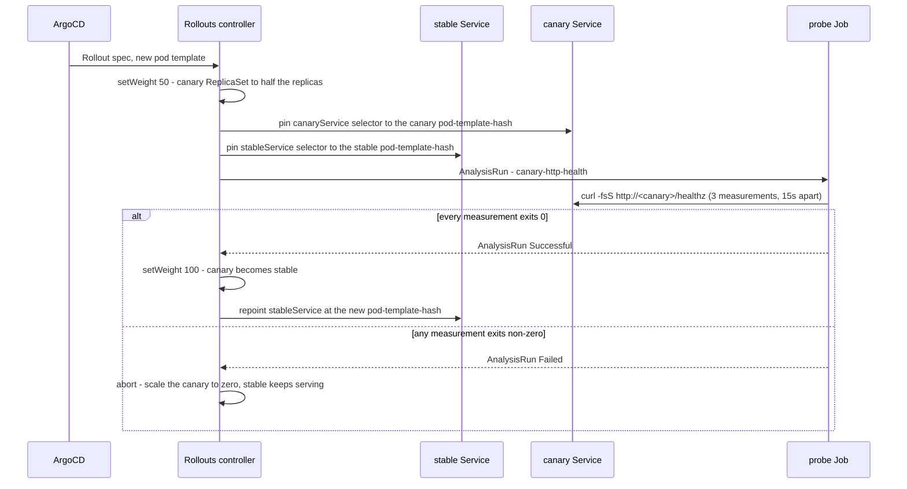

# Progressive delivery: Argo Rollouts canary + automated rollback

The golden path does not cut a Deployment over in one step. A workload declared as a
`Rollout` sends the new revision to half the replicas, an analysis probes it, and the
controller either promotes it or aborts back to the stable ReplicaSet on its own. No
operator, no `kubectl rollout undo`.

| Application | Chart (`configuration/versions.yaml`) | Wave | Notes |
|---|---|---|---|
| `argo-rollouts` | `argo-rollouts` (`charts.argo-rollouts`) | 2 | controller and the `Rollout` / `AnalysisTemplate` / `ClusterAnalysisTemplate` / `AnalysisRun` / `Experiment` CRDs; metrics Service on 8090, no dashboard |
| `argo-rollouts-config` | `charts/argo-rollouts-config` | 3 | the `canary-http-health` ClusterAnalysisTemplate every canary references |

Both are enabled in every set, Kind included, because the rollback behaviour is proven on
the Kind loop at level 2 (`tests/e2e/argo-rollouts`).

## The canary contract



Steps, in order: `setWeight: 50` -> `analysis` -> `setWeight: 100`.

## Delivery and ordering guarantees

- **Steps are strictly ordered and sequential.** The analysis never starts before the canary
  pods are available, and `setWeight: 100` never runs before the analysis returns Successful.
- **The verdict is at-least-once probing, not a single sample.** `count: 3`, `interval: 15s`,
  `initialDelay: 10s`. Each measurement is an independent Job; a retried or duplicated Job is
  harmless because the probe is a read.
- **`failureLimit: 0` — the first failed measurement aborts.** A canary that cannot serve its
  own health endpoint has nothing to average out. The cost is that a genuinely flaky network
  aborts a good revision; the alternative is shipping a broken one.
- **Rollback is not a redeploy.** The stable ReplicaSet was never scaled to zero, so aborting
  is a scale-down of the canary. There is no window in which no pod serves.
- **The canary is probed, not exposed.** Naming `stableService` makes the controller patch a
  `rollouts-pod-template-hash` selector onto that Service pinned to the stable ReplicaSet, so
  between `setWeight: 50` and `setWeight: 100` the canary pods are not endpoints of the stable
  Service and the analysis probe on `canaryService` is their only caller. `tests/e2e/argo-rollouts`
  measures this mid-canary and fails if the selector loses the hash or gains a canary endpoint.
- **`setWeight` is a replica proportion, not a traffic share.** There is no `trafficRouting`, so
  the number decides how many pods run the new revision, not how requests are split.
  `paperclip-exporter` runs `replicas: 1`, where 50% is not representable in whole pods.
- **Both revisions run at once as pods, which is what a workload has to tolerate.** The stable and
  canary ReplicaSets are up together during the canary window. A revision that cannot share a
  database, a stream or a consumer group with its predecessor needs `blueGreen`, not `canary`:
  pinning the stable Service keeps requests off the canary, not the canary off a shared backend.
- **An aborted Rollout stays `Degraded` with `status.abort: true`** until a new revision is
  pushed. It does not retry the same image.

## The analysis metric and its source

`canary-http-health` (`charts/argo-rollouts-config/templates/canary-http-health.yaml`) is the
only analysis the golden path ships. Its source is an **in-cluster HTTP probe Job**: a
`curlimages/curl` pod that runs `curl -fsS` against the canary Service and hands its exit code
to the controller. A refused connection, a timeout or any status >= 400 fails the measurement.

It deliberately does **not** query Prometheus. A scrape has to land inside the analysis window
for a Prometheus verdict to mean anything, which makes the rollback non-deterministic in CI,
and it would make canary behaviour depend on a metrics pipeline a fork may not run. The Job
carries no hostname, cluster name, registry or account: the Service DNS name and namespace
arrive as analysis arguments, and the image tag comes from `configuration/versions.yaml`.

Arguments: `service` (the canary Service), `namespace` (usually
`valueFrom.fieldRef: metadata.namespace`), `port` (default `80`), `path` (default `/healthz`).

## The shipped canary

`paperclip-exporter` (`charts/paperclip/templates/exporter.yaml`) is the first golden-path
workload on this path — a real workload, scraped by a ServiceMonitor and documented in
[runbooks/paperclip-agents.md](runbooks/paperclip-agents.md), not a sample. It declares
`canaryService: paperclip-exporter-canary` and `stableService: paperclip-exporter`, and its
analysis step probes port 9464.

The canary Service is deliberately not labelled `app.kubernetes.io/name: paperclip-exporter`:
the ServiceMonitor selects Services by that label and would otherwise scrape the canary pods
as a second source of the same series.

## Watching a rollout

```bash
kubectl argo rollouts get rollout paperclip-exporter -n paperclip --watch
kubectl get rollout paperclip-exporter -n paperclip -o jsonpath='{.status.phase} {.status.abort}{"\n"}'
kubectl get analysisrun -n paperclip -o custom-columns=NAME:.metadata.name,PHASE:.status.phase
kubectl describe rollout paperclip-exporter -n paperclip   # events carry the abort reason

# which revision the stable Service is pinned to, and which pods it actually reaches
kubectl get svc paperclip-exporter -n paperclip -o jsonpath='{.spec.selector}{"\n"}'
kubectl get endpoints paperclip-exporter -n paperclip -o jsonpath='{.subsets[*].addresses[*].ip}{"\n"}'
```

An abort reads `Rollout aborted update to revision N: Metric "canary-http-health" assessed
Failed` in the Rollout's events.

## Proof

`tests/e2e/argo-rollouts/chainsaw-test.yaml` runs on the Kind loop at level 2
(`task verify LEVEL=2`, `task test:e2e -- --test-dir tests/e2e/argo-rollouts`). It asserts the
shipped `Rollout/paperclip-exporter` is wired to `canary-http-health`, then drives a fixture
Rollout in the chainsaw namespace through both outcomes: a healthy revision promoted after a
`Successful` AnalysisRun, and a revision whose pods are Ready but silent on the Service port
aborted by a `Failed` AnalysisRun, with the stable Service still answering 200.

The failure case is exercised, not read off the config: the broken revision listens on 8081
while the Services target 8080, so its pods pass their own readiness probe and still fail the
canary probe.

The `canary-promotion` step also measures the stable Service inside the canary window, because
the pinning above is controller behaviour a chart bump could change silently. It waits until the
Rollout's `status.stableRS` differs from `status.currentPodHash` with a Ready canary pod and an
in-flight AnalysisRun, then prints the selector, the endpoint addresses and every pod's hash, and
fails if the selector is not the stable hash or if a canary pod IP is one of the endpoints. Never
landing in that window is a failure too, so the step cannot pass without measuring anything.

## Giving a new workload a canary

1. Change `kind: Deployment` to `apiVersion: argoproj.io/v1alpha1`, `kind: Rollout`. Everything
   under `spec.template` stays as it was.
2. Add a second Service for the canary, selecting the same pods, **without** any label a
   ServiceMonitor selects on.
3. Add the strategy:

   ```yaml
   strategy:
     canary:
       canaryService: <name>-canary
       stableService: <name>
       steps:
         - setWeight: 50
         - analysis:
             templates:
               - templateName: canary-http-health
                 clusterScope: true
             args:
               - name: service
                 value: <name>-canary
               - name: namespace
                 valueFrom:
                   fieldRef:
                     fieldPath: metadata.namespace
               - name: port
                 value: "<service port>"
         - setWeight: 100
   ```

4. The owning Application must sync after wave 3. Level 0 (`gitops/<env>/crd-order`) fails
   otherwise — `tests/gitops/crd-providers.yaml` maps the progressive-delivery kinds to the
   `argo-rollouts` Application.
