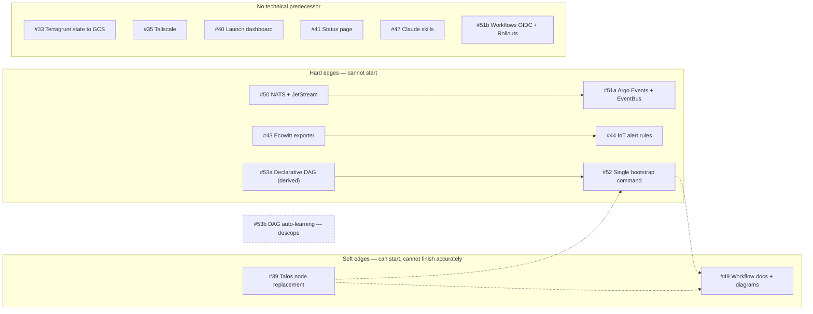

# Technical dependency map — the 13 open issues (2026-09-25)

The **technical** blocking relationships between the open `ryanmcafee/homelab` issues, written
by the Principal Platform Architect so the Platform Product Manager can sequence against
something other than intuition. This is the dependency map, not the ranking: it says what
*cannot* be done before what. Priority is the PM's call.

Scope: #33, #35, #39, #40, #41, #43, #44, #47, #49, #50, #51, #52, #53 (excluding #154, the
Renovate dashboard).

## The graph

## Edge-by-edge

### Hard: #51 (Argo Events) blocked by #50 (NATS) — **confirmed, with a split**

The `EventBus` is configured with `jetstreamExotic.url` pointing at the NATS service. It cannot
be written, let alone validated, before NATS exists. Neither chart is in the repository today
(no `nats`, `argo-events` or `argo-rollouts` under `charts/`), so this is a genuine
cold-start edge.

**Correction:** the edge covers only part of #51. That issue bundles three things:

| Part | Depends on #50? |
|---|---|
| **#51a** Argo Events + `EventBus` + example Sensor | **yes** |
| **#51b** Argo Workflows 0.45.2 → 0.47.1 with native OIDC | no |
| **#51c** Argo Rollouts + dashboard ingress | no |

`argo-workflows.yaml` is already an addon in this repository. #51b and #51c can ship while
#50 is still in flight. Splitting #51 removes the only item that makes #50 look like a
critical-path blocker for three separate deliverables.

### Hard: #44 (IoT alert rules) blocked by #43 (Ecowitt exporter) — **confirmed**

The rules match on `ecowitt_batterylevel`, `ecowitt_soilmoisture` and
`up{job="ecowitt-exporter"}`. A `PrometheusRule` referencing metrics that do not exist is
syntactically valid and permanently silent, which is worse than not shipping it — it looks like
monitoring. The edge binds acceptance, not authoring: the rules can be drafted first, they
cannot be *verified* first.

### Hard: #52 (bootstrap) blocked by #53a (declarative DAG) — **corrected**

The PM recorded #53 and #52 as "coupled, same vertical slice". The direction matters, and it
runs the way the PM's acceptance criterion implies rather than the way "coupled" suggests:
**#52 depends on #53a, not the reverse.**

Building the bootstrap resolver against a hard-coded order and lifting it to the DAG later
means writing the resolver twice — the second time against a different input shape. The DAG
format plus cycle detection is the smaller piece and it is the input contract for the larger
one. Contract before implementation: land #53a first, then #52 consumes it.

**Architectural condition on #53a — the DAG must be derived, not hand-maintained.** The issue
proposes a hand-written `configuration/deployment-dag.yaml`. This repository already encodes
deployment order twice over, in two places that are load-bearing:

- ArgoCD **sync waves** on the Application templates (waves −2 … 8)
- Terragrunt **`dependency` blocks** across the 11 units in `terragrunt/environments/homelab`

A third hand-written file would be a third source of truth that drifts silently the first time
someone changes a sync wave, and a stale ordering file is exactly the failure mode that makes
a bootstrap hang at 3am. #53a therefore **generates** the DAG from the sync waves and the
Terragrunt dependency graph, validates it (cycle detection, orphan detection), and fails the
level-0 gate when the committed DAG does not match what the repository actually declares. That
is smaller than the issue as written, and it is correct rather than convenient.

### Hard: #52 blocked by nothing else — the #52 language question does not move anything

Resolved as **ADR-031**: the distributable CLI stays Go, repository scripting stays
TypeScript/Bun, and the boundary rule is distribution — if a stranger must run it before they
have a toolchain, it is Go. #52 proceeds in `cmd/homelab` exactly as the issue specifies. No
sequencing change; the answer was needed before implementation, not before ranking.

### Soft: #52 and #49 soft-blocked by #39 (Talos node replacement) — **confirmed and extended**

#39 is a real bug: a recreated node gets a new machine ID while keeping its IP, and etcd
rejects the join because that IP is registered to a different member. `talos-node-recreate.ts`
never removes the etcd member first.

The PM recorded #39 as "blocks nothing formally". **There is a formal-enough edge they
missed: #39 soft-blocks #52.** The bootstrap's "resume from failure" and "rollback on failure"
requirements exercise node lifecycle repeatedly. Building them on top of a known-broken node
replacement means either encoding a workaround into the resolver or discovering the bug from
inside a half-built cluster. Fix #39 first and #52's failure paths are testable.

### Soft: #49 (workflow docs) soft-blocked by #52 and #39 — **confirmed, with the block narrowed**

Correct for the bootstrap and node-replacement pages. **Narrow it:** the block is on those
behaviours' *contracts*, not their completion. Once #53a's DAG format and #52's command surface
are settled, the pages can be written against them and verified when the code lands. The other
ten or so pages (secrets, local dev, application deployment, certificate renewal) have no
predecessor and start immediately.

#49 also now has an input rather than a blocker: the ADR set landed in this change
(ADR-025…ADR-031) and `docs/contracts/` are the architecture pages #49 would otherwise have to
invent. Hand-off to the DX & Docs Advocate.

### Overruled: #40 and #41 soft-blocked by #51 for OIDC — **no such edge**

The PM's reasoning was that both should reuse the OIDC middleware #51 establishes rather than
stand up a second auth path. The premise is wrong, and checkably so.

**The OIDC middleware already exists in this repository.**
`charts/traefik-external-config/templates/oidc.yaml` defines the `oidc-auth` Traefik
`Middleware` and the `auth-oidc` chain, backed by the `oauth2-proxy` and `oidc-redis` addons,
configured from `TRAEFIK_OIDC_PROVIDER_URL` and `TRAEFIK_OIDC_ALLOWED_DOMAINS` in the
ConfigSet. #40 and #41 annotate their IngressRoutes with it and are done.

What #51b adds is **native OIDC inside Argo Workflows** — the application authenticating
users itself, which Argo needs because its UI carries per-user RBAC. That is a different
mechanism for a different reason, and nothing in #40 or #41 waits on it.

**#40 and #41 are independent and can move as early as the PM wants them to.**

### Independent: #33, #35, #47

- **#33 (Terragrunt state → GCS).** No technical predecessor. One sequencing hazard worth
  recording: it rewrites the state backing the same Terragrunt units #39 and #52 drive, so it
  should not run *concurrently* with either. That is a scheduling constraint, not an edge.
- **#35 (Tailscale).** Partially landed already — `tailscale-operator` is an addon and
  `tests/health/tailscale.com_Connector` exists. The remaining work (egress ProxyGroup,
  ExternalName services for TrueNAS NFS, TrueNAS-side install) has no predecessor.
- **#47 (Claude skills).** `.claude/skills/` already exists. Independent, and it gets better
  after #49 documents the workflows the skills would automate — a benefit, not a blocker.

## What this change unblocks

**#50 can now design its streams.** The PM flagged that the NATS work needs the CloudEvents
subject and stream taxonomy to name its first streams. That taxonomy is now published and
machine-checked: `contracts/events/subjects.v1.yaml` defines `PF_EVENTS`, `PF_AUDIT` and
`PF_WORK` with their retention, replication and delivery guarantees, and
`contracts/events/registry.v1.yaml` names the first eleven event types. #50 implements those
three streams rather than inventing a naming scheme that #51a then has to live with.

## Position on #53 auto-learning — **descope, and do not reopen it as written**

The PM marked the "MCP memory server learns dependencies and auto-updates the DAG" half as not
ready to rank. Agreed, and the objection is stronger than a ranking one.

A dependency graph that mutates itself from observed deployments is **outside change
control**. The DAG decides the order in which a cluster is built; a file that rewrites itself
based on what happened last time means a bootstrap whose behaviour changes without a commit,
no review, and no rollback — the opposite of every other ordering decision in this repository,
all of which are declarative and in Git.

Split #53 as:

- **#53a — declarative DAG**, generated from the sync waves and Terragrunt dependencies,
  validated in level 0. Ready to rank. Blocks #52.
- **#53b — learning from deployment experience.** Not cancelled; re-scoped. The useful version
  is: when a deployment reveals an ordering the DAG does not express, the tooling **opens a
  pull request** with the proposed edge and the evidence. A human merges it. That keeps the
  learning and keeps change control, and it has a testable definition of success — the PR is
  correct or it is not — which the original framing lacked.

Open #53b separately with that scope. It has no dependents and no urgency.

## Summary for sequencing

| Issue | Blocked by (hard) | Soft | Notes |
|---|---|---|---|
| #33 | — | — | Do not run concurrently with #39 or #52 |
| #35 | — | — | Partially landed |
| #39 | — | — | Bug; soft-blocks #52 and #49 |
| #40 | — | — | **Independent** — OIDC middleware already exists |
| #41 | — | — | **Independent** — same |
| #43 | — | — | |
| #44 | #43 | — | Binds acceptance, not authoring |
| #47 | — | — | Better after #49, not blocked by it |
| #49 | — | #52, #39 (contracts, not completion) | Most pages start now; ADR set is its input |
| #50 | — | — | Unblocked for design by ADR-026 |
| #51a | #50 | — | Argo Events only |
| #51b/c | — | — | Workflows OIDC, Rollouts — split out |
| #52 | #53a | #39 | Go, per ADR-031 |
| #53a | — | — | Must be **derived**, not hand-written |
| #53b | — | — | Descoped to a PR-proposing tool |

Reconciliation with the PM's ranked `backlog` document is tracked on MCAA-18; revising that
document from this map is the PM's call, not this map's.
