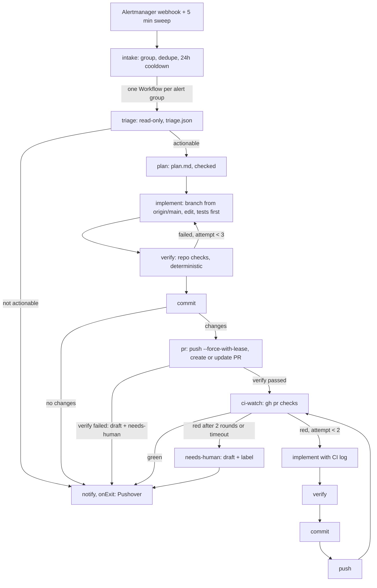

# Alert triage agent

Every firing alert becomes an Argo Workflow that diagnoses it with Claude, plans and implements a
fix in this repository, verifies it with the repository's own checks, opens a pull request,
watches CI and sends the result to your phone through Pushover. The cluster changes only when
you merge the pull request (ADR-033).

| Piece | Where |
|---|---|
| Service + stages (Bun + TypeScript) | `triage-agent/src/`, tests in `triage-agent/tests/unit/` (`task test:triage-agent`) |
| Image | `Dockerfile.triage-agent`, published by `.github/workflows/triage-agent-image.yml` as `ghcr.io/<owner>/homelab-triage-agent:<images.triage-agent>` |
| Chart | `charts/triage-agent`: intake Deployment, WorkflowTemplate `triage-fix`, ServiceAccounts, cache PVC, ConfigMaps, OnePasswordItems |
| Application | `charts/addons/templates/triage-agent.yaml`, wave 10, only with a secret store and Argo Workflows |
| Alertmanager route | `charts/addons/templates/kube-prometheus-stack.yaml`: receiver `triage-agent`, `continue: true` |
| ArgoCD account | `charts/bootstrap/values-homelab.yaml`: `accounts.triage-agent: apiKey`, role `get` + `sync` on applications |

## Flow



| Stage | Model | What it does | Output |
|---|---|---|---|
| `triage` | yes, read-only tools | Diagnoses with kubectl (view + exec), the Alertmanager API, repo history, runbooks | `triage.json` (`actionable`, `rootCause`, `evidence`, `confidence`, `recommendedFix`) |
| `plan` | yes, read-only tools | Writes `plan.md`: Why (<= 100 words), Commit message, Files, Change, Tests, Risk; rejected unless every section is there and the commit message is conventional | `plan.md` |
| `implement` | yes, Bash/Edit/Write in `/work` | Cuts `triage/<alertname>-<hash of group>` from fresh `origin/main` (no tracking), or checks out that branch if an earlier run pushed it; edits and runs checks; never commits | edited tree |
| `verify` | no | `mise install` of the repo's toolchain, then `task config:export:localdev`, `task test:snapshot -- --update`, `task docs:check -- --fix` where relevant, `task verify:text`, `task config:guard` and the unit tests of what changed | `verify.log`, `passed`, `next` |
| `commit` | no | Commits as `homelab-triage-agent` with the plan's commit message | `changed` |
| `pr` | no | `git push --force-with-lease`; `gh pr list --head <branch>` updates an open PR instead of opening a second one; draft + `triage-agent/needs-human` when verify never passed | `pr.json` |
| `ci-watch` | no | Polls `gh pr checks` (up to 1 h); on red saves the failing runs' logs to `ci.log` | `ci-state`, `next` |
| `needs-human` | no | Marks the PR draft and labels it `triage-agent/needs-human` | |
| `notify` | no | onExit, always: Pushover with the PR link, CI state and root cause, or the report, or the failure | |
| `argocd-sync` | no | Not in the default path; `argo submit --from workflowtemplate/triage-fix --entrypoint argocd-sync -p app=<name>` | |

The fix loops are bounded by `next` (`loopDecision` in `triage-agent/src/stages/loop.ts`):
3 implement/verify rounds (`workflow.fixAttempts`), 2 CI rounds (`workflow.ciAttempts`).
`retryStrategy` (2 retries, backoff 30 s x2) only covers a step that crashed or errored; a failed
check is an output, not an error, and goes through the loop instead. Every step has an
`activeDeadlineSeconds` (`workflow.deadlines`), the workflow 5 h. A semaphore
(`triage-agent-sync`, `workflow.maxConcurrent: 1`) runs one workflow at a time and a mutex per
alertname keeps two runs of the same alert apart. Pods of successful steps are deleted at once,
failed ones stay until the workflow's TTL (1 day success, 3 days failure).

The intake skips `Watchdog`, `InfoInhibitor` and `GitHubPullRequestNeedsReview`, does not submit
while a workflow for the same group is still running, and resubmits a group within 24 h only for
a new fingerprint.

## Before it runs

1. **1Password item** `TRIAGE_AGENT_1P_PATH` (default `vaults/homelab/items/triage-agent`), Secret `triage-agent`:

   | Field | Required | Value |
   |---|---|---|
   | `CLAUDE_CODE_OAUTH_TOKEN` | yes | `claude setup-token` (Claude subscription) |
   | `GITHUB_TOKEN` | yes, for PRs | Fine-grained PAT: this repository with Contents read/write and Pull requests read/write (Actions read for CI logs); the dotfiles repository with Contents read |
   | `DOTFILES_REPO` | no | `<owner>/<repo>` of the private dotfiles; its `claude/CLAUDE.md` and `claude/profiles/personal/CLAUDE.md` become the agent's user memory |
   | `ARGOCD_AUTH_TOKEN` | no | `argocd account generate-token --account triage-agent` |
   | `PAPERCLIP_API_KEY`, `PAPERCLIP_COMPANY_ID` | no | Both enable the paperclip MCP server |

2. **Pushover**: nothing new. The chart reads the Alertmanager item (`ALERTMANAGER_1P_PATH`,
   fields `pushover_token`, `pushover_user_key`) into Secret `triage-agent-pushover`.
3. **Image visibility**: the first publish creates the `homelab-triage-agent` package private; make
   it public (GitHub -> Packages -> Package settings) or the cluster cannot pull it.
4. **ArgoCD token** (optional): after the bootstrap sync, generate the `triage-agent` token as above.

Without the item the intake runs but every workflow step waits in `CreateContainerConfigError`.
`TRIAGE_AGENT_ENABLED=false` turns the whole feature off; Kind renders none of it (no secret store,
no Argo Workflows).

## Watch it

```bash
kubectl -n triage-agent get workflows                         # or the Argo Workflows UI (WORKFLOWS_HOSTNAME)
argo -n triage-agent logs @latest --follow
argo -n triage-agent get @latest                              # the DAG with each step's outputs
kubectl -n triage-agent port-forward svc/triage-agent 8080 &
curl -s localhost:8080/submissions | jq                       # what the intake did with each group
curl -s localhost:8080/metrics                                # submissions, sweep failures, queue depth
```

Trigger a run with a synthetic alert (`docs/runbooks/alerting.md`, Test delivery). With
`workflow.fakeLlm: true` the three model stages return canned answers, so the DAG runs end to end
without Claude (triage says "not actionable", notify still fires); `intake.dryRun: true` logs the
Workflow instead of submitting it.

## Toolchain

The image carries node, bun, uv, git, gh, kubectl, argocd and mise. `verify` and `implement` run
`mise install go helm bun kubeconform conftest pluto task yq` from the cloned repository's
`mise.toml`, so the versions are the ones CI pins; everything lands on the cache PVC
(`triage-agent-cache`, with Go, npm, uv and bun caches and the memory MCP graph) and is reused by
later workflows. The first run downloads the toolchain (a few minutes); later runs start in seconds.

| MCP server | Default | Notes |
|---|---|---|
| sequential-thinking, context7, memory | on | `npx`, versions pinned in `charts/triage-agent/values.yaml`; memory at `/cache/memory/memory.json` |
| serena | on | from the repository's `.mcp.json`; the chart copy is skipped so it is registered once |
| paperclip | with both Paperclip fields | `uvx paperclip-mcp` against `paperclip.paperclip.svc:3100`, read tools only |
| puppeteer | off | deprecated upstream; the image has no Chromium |
| codesearch | n/a | a workstation binary, not available in the cluster |

## Security model

- Workflow steps run as ServiceAccount `triage-agent-workflow`, bound to `view` and
  `homelab-agent-readonly` (`charts/agent-readonly`, not widened): no Secrets, no write verbs,
  `pods/exec` and port-forward for diagnosis. The intake's ServiceAccount may only create, get and
  list Workflows in its namespace.
- Every model stage runs in `dontAsk` mode (never prompts) behind a PreToolUse hook
  (`triage-agent/src/policy.ts`, unit-tested) that denies: mutating kubectl verbs (apply, delete,
  patch, edit, scale, create, replace, annotate, label, rollout restart/undo, cordon, drain, cp,
  ...), also inside `bash -c`, `xargs` or `kubectl exec`; `gh pr merge` and merge calls through
  `gh api`; `git push` to main or master (force pushes to other branches are allowed);
  POST/PUT/PATCH/DELETE with curl or wget against Alertmanager or Prometheus and
  `amtool silence add|expire|import`; Edit/Write outside `/work` and `/tmp`.
- `argocd app sync` is allowed through the `triage-agent` ArgoCD account (get + sync on
  applications only). Merging stays with a human; the PAT could merge, the hook refuses it.
- Only the monitoring namespace may reach the intake webhook (NetworkPolicy). The namespace is
  PodSecurity `baseline` because Argo's executor containers carry no securityContext; every agent
  container runs as uid 1000 with no capabilities and a read-only root filesystem.
