<p align="center">
  
</p>

<h1 align="center">homelab</h1>

<div align="center">

<!-- docs-check:begin badges -->
[](https://www.talos.dev/)
[](https://kubernetes.io/)
[](https://argoproj.github.io/cd/)
[](https://cilium.io/)
[](https://developer.hashicorp.com/terraform)
[](https://helm.sh/)
<!-- docs-check:end badges -->
[](https://github.com/ryanmcafee/homelab/actions/workflows/verify.yml)
[](LICENSE)

</div>

<p align="center">A production-grade Kubernetes homelab you can fork and boot with one command.<br>
Talos on Proxmox, ArgoCD app-of-apps, Cilium BGP to a UniFi gateway, no PII in git, and every number on this page checked by CI.</p>

## Boot it on your laptop

Docker is the only requirement. The Kind loop runs the same charts production does, with fakes
standing in for 1Password, TrueNAS and the UniFi gateway.

```bash
task localdev:up        # Kind (Cilium, registry caches, fakes) → ArgoCD → all 70 Applications synced from your working tree
task localdev:report    # what is Healthy, and what differs from main
task localdev:down      # delete the cluster; the registry caches stay
```

ArgoCD is on http://localhost:8080 (`admin`, password in `argocd-initial-admin-secret`; on macOS run
`task localdev:ui` first). `task verify LEVEL=2` runs the 17 chainsaw suites against it.

## Boot it on real hardware

```bash
task setup                              # detects your tier: Kind loop by default, production only when asked
task validate -- --environment homelab  # the per-tier prerequisite table, with a fix hint per missing row
```

Production needs three things you bring: a **Proxmox VE** host with SSH key auth, a **1Password**
vault named `homelab` (`op signin`), and a **UniFi** gateway that can speak BGP. Copy
`configuration/environments/homelab.yaml.example` to `homelab.yaml`, fill it in (it is gitignored
and PII-guarded), then `task setup -- --environment homelab` walks Ansible → Terragrunt → GitOps
with a confirmation at each phase. Nothing reaches `terragrunt apply` without that flag.

## The stack, layer by layer

| Layer | What runs | Where |
|---|---|---|
| Host | Ansible prepares Proxmox: repos, networking, storcli, IPMI fans, log retention | [`ansible/`](ansible/) |
| Infra | Terragrunt DAG (11 units): ZFS pools, TrueNAS, Talos images, 3 control planes on NVMe + 3 workers, cluster config, UniFi FRR | [`terragrunt/`](terragrunt/) |
| Bridge | `gitops-bootstrap` installs ArgoCD with the `homelab-cmp` sidecar, the SOPS age key and the root Application | [`terragrunt/modules/gitops-bootstrap/`](terragrunt/modules/gitops-bootstrap/) |
| GitOps | app-of-apps: `gitops` → `bootstrap` → 29 addons → 15 applications, plus per-PR previews | [`charts/`](charts/) |
| Secrets | SOPS + ksops for the bootstrap credentials, 1Password operator for everything else | [`docs/secrets.md`](docs/secrets.md) |
| Config | One schema-driven `configuration/`; the CMP renders values at sync time so no PII is committed | [`configuration/`](configuration/) |
| Network | Cilium LB IPAM + BGP ⇄ UniFi, two Traefiks (external with OIDC, internal), external-dns ×2, port-forwarding controller, Tailscale subnet router + split DNS | [`docs/networking.md`](docs/networking.md) |
| Verify | level 0 static (< 5 s) → Kind + ArgoCD + chainsaw → PostSync smoke Jobs in production | [`tests/`](tests/) |

## What's running on it

**Media** · plex · sonarr · radarr · prowlarr · nzbget · tautulli · lazylibrarian · flaresolverr
**Platform** · argocd · grafana · argo-workflows · paperclip · cloudnative-pg · mosquitto · renovate

29 addons and 15 applications, 70 ArgoCD Applications in all. The full table with chart versions,
ingress class and test coverage per app is generated in [`docs/applications.md`](docs/applications.md).

## Guardrails

- Every PR: level 0 (render, schema, policy, golden snapshots) in seconds, then the Kind loop with 17 chainsaw suites; label `preview` and the PR gets its own namespace in production.
- Renovate automerges non-major bumps only when the upstream chart diff passes the same gates (ADR-014).
- `task config:guard` blocks real IPs, hostnames and e-mail addresses from ever being committed.
- `task docs:check` recomputes every version and count on this page from the repo and fails CI when they drift.
- Weekly CloudNativePG restore drill; agents get read-only production access over Tailscale, never write.
- etcd runs on its own NVMe pool because sharing one with the workers cost us the API server ([why](docs/runbooks/control-plane-storage.md)).

## Where things live

```text
ansible/         Proxmox host roles and playbooks
terragrunt/      modules + homelab/localdev environments
talos/ packer/   machine config and images
charts/          gitops, bootstrap, addons, applications, child charts
configuration/   schema, environments, versions.yaml, export templates
cmd/ internal/   the `homelab` CLI (Go)
scripts/         Deno automation the Taskfile runs
localdev/        Kind values and fakes
tests/           e2e (chainsaw), snapshots, policy, drills
docs/            architecture, networking, runbooks, ADRs
```

## Docs

[Architecture](docs/architecture.md) · [Networking](docs/networking.md) · [Applications](docs/applications.md) · [Secrets](docs/secrets.md) · [Tooling](docs/tooling.md) · [Hardware](docs/hardware.md) · [Local development](docs/local-development.md) · [Runbooks](docs/runbooks/) · [Decisions](docs/project_notes/decisions.md)
